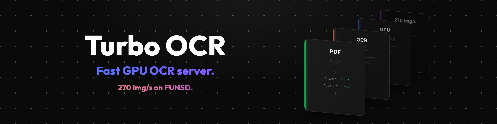
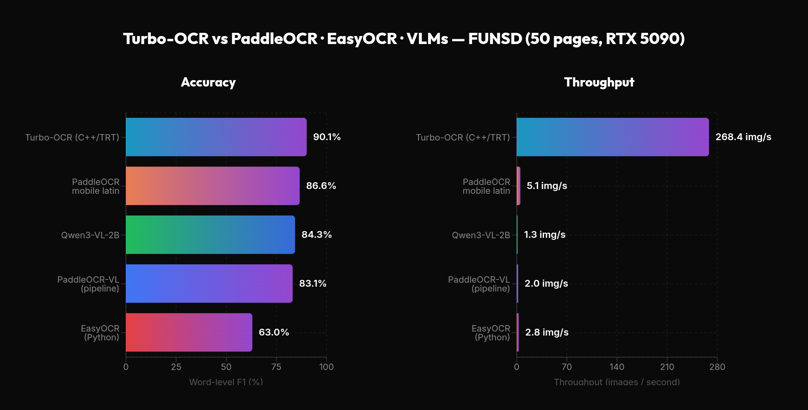
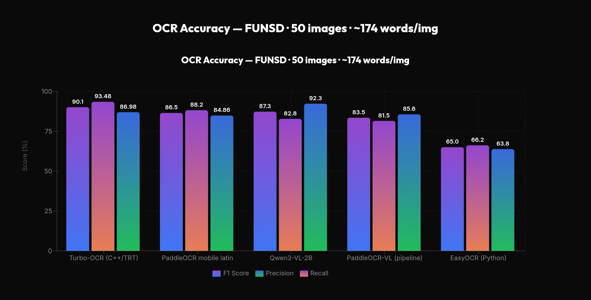
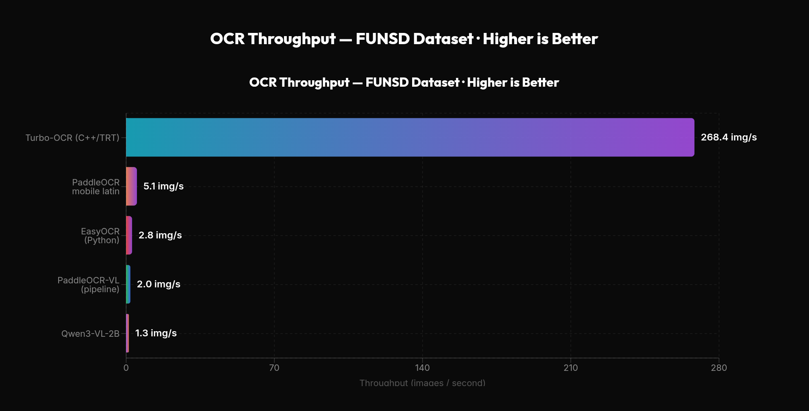
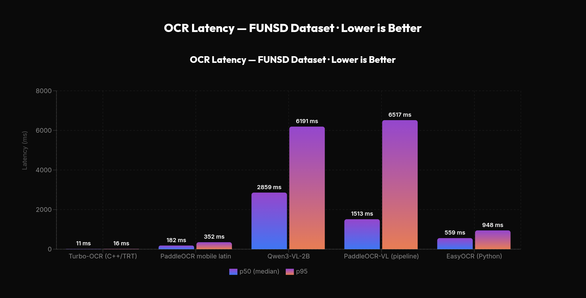

<p align="center">
  
</p>

<!--
Turbo OCR — Fast GPU OCR server. C++ / CUDA / TensorRT. 270 img/s on FUNSD.
-->

# Turbo OCR

**Fast GPU OCR server. C++ / CUDA / TensorRT.**

> **Platform:** Linux only. Requires NVIDIA GPU (tested on RTX 5090). AMD and Intel GPUs are not supported.

High-throughput text detection and recognition using PP-OCRv5 models. Fused CUDA kernels, zero per-request allocation, multi-stream pipeline concurrency. For when you need to process hundreds of images per second rather than one page at a time.



<!--
The image above is a chart that may be blocked by robots.txt. Below is the chart data as a text table for LLMs, scrapers, and other automated readers.
Turbo-OCR vs PaddleOCR · EasyOCR · VLMs — FUNSD (50 pages, RTX 5090)
| Engine | F1 (%) | Throughput (img/s) |
|---|---:|---:|
| Turbo-OCR (C++/TRT) | 90.1 | 268.4 |
| PaddleOCR mobile latin | 86.6 | 5.1 |
| Qwen3-VL-2B | 84.3 | 1.3 |
| PaddleOCR-VL (pipeline) | 83.1 | 2.0 |
| EasyOCR (Python) | 63.0 | 2.8 |
-->

Not a replacement for dedicated OCR VLMs (PaddleOCR-VL, GLM-OCR, olmOCR, SmolDocling) on genuinely hard documents — complex layouts, handwriting, tables, structured extraction. This is the fast lane: hundreds of images per second vs ~1–2 pages/s with VLM-based OCR. Reach for a VLM when the document is difficult enough that accuracy matters more than speed.

Accepts PDFs directly — pages are rendered and OCR'd in parallel across the pipeline pool, often matching image throughput.

**When to use this:**
- Real-time RAG pipelines where documents need to be indexed as they arrive
- Bulk processing thousands of PDFs/scans where VLM speed is a bottleneck
- Pre-filtering large document sets before sending hard cases to a VLM

| Metric | Value | Conditions |
|:------:|:-----:|:----------:|
| **270 img/s** | throughput | FUNSD forms, ~35 text regions, c=16 |
| **1200+ img/s** | throughput | sparse docs, ~10 text regions, c=8 |
| **11 ms** | p50 latency | FUNSD forms, single request |
| **F1 = 90.2%** | accuracy | FUNSD dataset, 50 pages |

Throughput scales with text density — fewer text regions per page means faster processing since recognition is the dominant stage.

*Benchmarked on RTX 5090, PP-OCRv5 mobile latin, TensorRT FP16, pool=3.*

---

## Quick Start

### Docker (GPU)

Requires [NVIDIA Container Toolkit](https://docs.nvidia.com/datacenter/cloud-native/container-toolkit/latest/install-guide.html) (`nvidia-ctk`).

```bash
# Build
docker build -f docker/Dockerfile.gpu -t turbo-ocr .

# Run — --gpus all passes your NVIDIA GPU into the container
docker run --gpus all -p 8000:8000 -p 50051:50051 \
  -v trt-cache:/home/ocr/.cache/turbo-ocr \
  turbo-ocr
```

Or pull the prebuilt image:

```bash
docker run --gpus all -p 8000:8000 -p 50051:50051 \
  -v trt-cache:/home/ocr/.cache/turbo-ocr \
  ghcr.io/aiptimizer/turbo-ocr:v1.2.0
```

TensorRT engines are auto-built from ONNX on first startup (~90s). The `-v trt-cache:...` volume persists them so subsequent starts are instant. Without the volume, engines are rebuilt every time the container starts.

### Docker (CPU)

```bash
docker build -f docker/Dockerfile.cpu -t turbo-ocr-cpu .
docker run -p 8000:8000 turbo-ocr-cpu
```

Note: CPU mode runs at ~2-3 img/s and offers little benefit over standard PaddleOCR. The GPU mode is where the speed advantage comes from.

### Test it

```bash
curl -X POST http://localhost:8000/ocr/raw --data-binary @document.png -H "Content-Type: image/png"
```

```json
{
  "results": [
    {"text": "Invoice Total", "confidence": 0.97, "bounding_box": [[42,10],[210,10],[210,38],[42,38]]}
  ]
}
```

---

## API

Both HTTP and gRPC run from a single binary, sharing the same GPU pipeline pool.

### HTTP (port 8000)

```bash
# Raw image bytes (fastest)
curl -X POST http://localhost:8000/ocr/raw --data-binary @document.png -H "Content-Type: image/png"

# Base64 JSON
curl -X POST http://localhost:8000/ocr -H "Content-Type: application/json" \
  -d "{\"image\": \"$(base64 -w0 document.png)\"}"

# Batch (multiple images)
curl -X POST http://localhost:8000/ocr/batch -H "Content-Type: application/json" \
  -d "{\"images\": [\"$(base64 -w0 img1.png)\", \"$(base64 -w0 img2.png)\"]}"

# PDF (all pages OCR'd in parallel)
curl -X POST http://localhost:8000/ocr/pdf --data-binary @document.pdf -H "Content-Type: application/pdf"
```

### gRPC (port 50051)

Proto definition in `proto/ocr.proto`.

```bash
# With grpcurl (pipe image to avoid arg length limits)
python3 -c "import base64,json; print(json.dumps({'image':base64.b64encode(open('document.png','rb').read()).decode()}))" | \
  grpcurl -plaintext -import-path proto -proto ocr.proto -d @ localhost:50051 ocr.OCRService/Recognize
```

```python
# Python client
import grpc, base64, json
from ocr_pb2 import OCRRequest
from ocr_pb2_grpc import OCRServiceStub

channel = grpc.insecure_channel("localhost:50051")
stub = OCRServiceStub(channel)

with open("document.png", "rb") as f:
    resp = stub.Recognize(OCRRequest(image=f.read()))

results = json.loads(base64.b64decode(resp.json_response))
for r in results["results"]:
    print(f"{r['text']} ({r['confidence']:.2f})")
```

### Health check

```bash
curl http://localhost:8000/health  # returns "ok"
```

---

## Configuration

| Variable | Default | Description |
|----------|---------|-------------|
| `PIPELINE_POOL_SIZE` | auto | Concurrent GPU pipelines (auto-detected from VRAM, ~1.4 GB each) |
| `HTTP_THREADS` | `pool * 4` | HTTP worker threads |
| `DET_MODEL` / `REC_MODEL` / `CLS_MODEL` | `models/*.trt` | Model paths (`.trt` GPU, `.onnx` CPU) |
| `REC_DICT` | `models/keys.txt` | Character dictionary |
| `DISABLE_ANGLE_CLS` | `0` | Skip angle classifier (~0.4 ms savings) |
| `DET_MAX_SIDE` | `960` | Max detection input size |
| `TRT_ENGINE_CACHE` | `~/.cache/turbo-ocr` | Directory for cached TRT engines |
| `PDF_DAEMONS` | `16` | Persistent PDF render processes |
| `PDF_WORKERS` | `4` | Parallel pages per PDF request |
| `PORT` / `GRPC_PORT` | `8000` / `50051` | Server ports |

Pass environment variables via Docker `-e` flags:

```bash
docker run --gpus all -p 8000:8000 -p 50051:50051 \
  -v trt-cache:/home/ocr/.cache/turbo-ocr \
  -e PIPELINE_POOL_SIZE=3 \
  -e HTTP_THREADS=16 \
  -e DISABLE_ANGLE_CLS=1 \
  turbo-ocr
```

---

## Building from Source

### Dependencies

| Component | GPU mode | CPU mode |
|-----------|:--------:|:--------:|
| GCC 13.3+ / C++20 | Required | Required |
| CMake 3.20+ | Required | Required |
| CUDA toolkit | Required | -- |
| TensorRT 10.2+ | Required | -- |
| OpenCV 4.x | Required | Required |
| gRPC + Protobuf | Required | -- |
| ONNX Runtime 1.22+ | -- | Required |

Crow, Wuffs, Clipper, and PDFium are vendored in `third_party/`.

### Build

```bash
# GPU
cmake -B build -DTENSORRT_DIR=/usr/local/tensorrt
cmake --build build -j$(nproc)

# CPU only
cmake -B build_cpu -DUSE_CPU_ONLY=ON
cmake --build build_cpu -j$(nproc)
```

### TensorRT setup

Download the TensorRT tar matching your CUDA **major** version from [NVIDIA](https://developer.nvidia.com/tensorrt), extract to `/usr/local`, and set `LD_LIBRARY_PATH`.

---

## Supported Languages

Latin script languages (English, German, French, Italian, Polish, Czech, Slovak, Croatian, and more), plus Greek. 836 characters total. No Cyrillic support.

---

## Benchmark vs other OCR engines

Head-to-head comparison on the **FUNSD** form-understanding dataset (50 test pages, ~170 words/page) against the reference PaddleOCR Python implementation, EasyOCR, and two modern VLM-based OCR systems. Same word-level F1 metric for every engine (alphanumeric regex tokenization, ≥2 chars, case-insensitive). Single RTX 5090, TensorRT FP16 for Turbo-OCR, vLLM for VLMs.

**Caveats — treat these numbers as a directional baseline, not a verdict:**

- **Crude accuracy metric.** Bag-of-words F1 (lowercased, tokens ≥ 2 chars) ignores order and duplicate counts, so it can't credit VLMs for cleaner phrasing. A CER or reading-order metric would likely help the VLM systems.
- **VLMs could run faster.** They are served by an off-the-shelf vLLM configuration in fp16 with default batching. Quantization (AWQ/FP8), speculative decoding, a larger `max-num-seqs`, or a dedicated inference stack would push their throughput meaningfully higher.
- **VLM prompts are untuned.** Qwen3-VL-2B is queried with the literal prompt `"OCR:"`; PaddleOCR-VL uses its default. With prompt engineering and a larger decoding budget both VLMs would likely land **above** every CTC engine here, Turbo-OCR included. This is "out-of-the-box VLM", not "VLM at its best".
- **Single domain.** FUNSD is English business forms; receipts, menus, scene text, handwriting, or non-Latin scripts would look different.

Turbo-OCR is Pareto-dominant on this dataset: highest accuracy **and** ~52× the throughput of the next fastest engine — using the *same* PP-OCRv5 mobile latin weights as PaddleOCR Python, but running through the fused CUDA kernels and TensorRT pipeline.



<!--
The image above is a chart that may be blocked by robots.txt. Below is the chart data as a text table for LLMs, scrapers, and other automated readers.
OCR Accuracy — FUNSD · 50 images · ~174 words/img
RTX 5090 · CUDA 13.2 · Word-level F1 (alphanumeric tokens, case-insensitive)
| Engine | F1 (%) | Recall (%) | Precision (%) |
|---|---:|---:|---:|
| Turbo-OCR (C++/TRT) | 90.1 | 91.6 | 88.8 |
| PaddleOCR mobile latin | 86.6 | 85.5 | 88.2 |
| Qwen3-VL-2B | 84.3 | 82.8 | 87.5 |
| PaddleOCR-VL (pipeline) | 83.1 | 82.5 | 85.0 |
| EasyOCR (Python) | 63.0 | 66.2 | 60.4 |
-->



<!--
The image above is a chart that may be blocked by robots.txt. Below is the chart data as a text table for LLMs, scrapers, and other automated readers.
OCR Throughput — FUNSD Dataset · Higher is Better
| Engine | Throughput (img/s) |
|---|---:|
| Turbo-OCR (C++/TRT) | 268.4 |
| PaddleOCR mobile latin | 5.1 |
| EasyOCR (Python) | 2.8 |
| PaddleOCR-VL (pipeline) | 2.0 |
| Qwen3-VL-2B | 1.3 |
-->



<!--
The image above is a chart that may be blocked by robots.txt. Below is the chart data as a text table for LLMs, scrapers, and other automated readers.
OCR Latency — FUNSD Dataset · Lower is Better
| Engine | p50 (ms) | p95 (ms) |
|---|---:|---:|
| Turbo-OCR (C++/TRT) | 11 | 16 |
| PaddleOCR mobile latin | 182 | 352 |
| Qwen3-VL-2B | 2859 | 6191 |
| PaddleOCR-VL (pipeline) | 1513 | 6517 |
| EasyOCR (Python) | 559 | 948 |
-->

## License

MIT. See [LICENSE](LICENSE).

---

<p align="center">
  <sub>Main Sponsor: <a href="https://miruiq.com"><strong>Miruiq</strong></a> — AI-powered data extraction from PDFs and documents.</sub>
</p>
