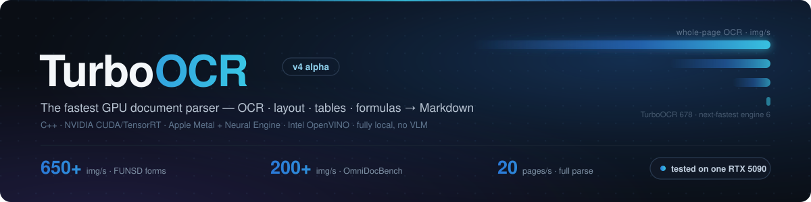
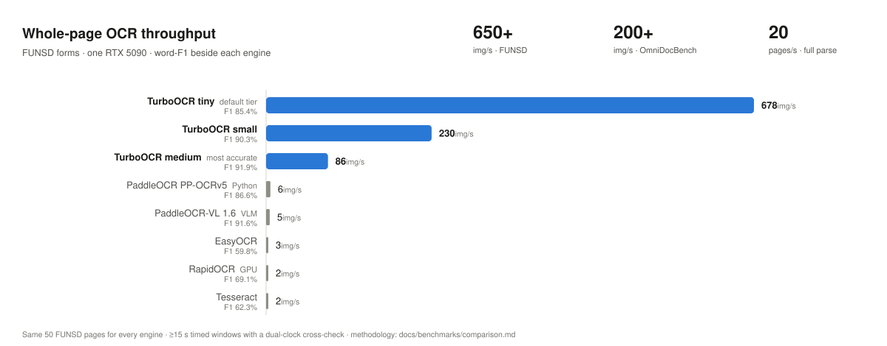

<p align="center">
  <sub>v4 alpha · 后端：NVIDIA、Apple（Metal + 神经引擎）、Intel（OpenVINO）、AMD（ROCm）、CPU · AMD 尚未在真实硬件上验证</sub>
</p>

<p align="center">
  
</p>

<p align="center">
  <a href="README.md">English</a> | <strong>简体中文</strong>
</p>

<p align="center">
  <strong>最快的 GPU 文档解析器 — OCR · 版面 · 表格 · 公式 → Markdown，单卡 650+ 张/秒。</strong><br>
  C++ / CUDA / TensorRT / PP-OCRv6 &mdash; Linux + NVIDIA GPU
</p>

<h3 align="center">v4.0-alpha — 一套流水线，多种后端</h3>
<p align="center">
  <sub>统一引擎 + 设备抽象层：NVIDIA · Apple Metal + 神经引擎 · Intel OpenVINO · AMD ROCm · 原生 Python 库 · PP-OCRv6 <code>tiny</code>/<code>small</code>/<code>medium</code> 三档 · <a href="docs/guides/upgrading-v4.md">v4 变更说明</a></sub>
</p>

<p align="center">
  <a href="https://github.com/aiptimizer/TurboOCR"><strong>⭐ 在 GitHub 上给 TurboOCR 点个 Star</strong></a>
</p>

<p align="center">
  
  <a href="https://turboocr.com"></a>
  <a href="https://github.com/aiptimizer/TurboOCR/releases/latest"></a>
  <a href="https://ghcr.io/aiptimizer/turboocr"></a>
  
  
  
  
  
  
  
  
</p>

<p align="center">
  <a href="#快速开始">快速开始</a> &middot;
  <a href="#基准测试">基准测试</a> &middot;
  <a href="#提升精度">精度</a> &middot;
  <a href="#模型">模型</a> &middot;
  <a href="#python">Python</a> &middot;
  <a href="#api">API</a> &middot;
  <a href="docs/index.md">文档</a>
</p>

---

TurboOCR 是一个完整的 GPU 文档解析器。它把 PP-OCRv6 文本检测与识别、
版面分析、表格识别（HTML）、公式识别（LaTeX）以及按阅读顺序导出的 Markdown
整合进一条设备驻留的流水线，通过 HTTP 和 gRPC 提供服务。所有推理都在本地完成，
不依赖视觉语言模型，也不调用任何外部 API。

在单张 RTX 5090 上实测：FUNSD 表单整页 OCR 超过 650 张/秒，完整结构化解析 20
页/秒；同类 VLM 文档解析器约为每秒 1 页（[基准测试](#基准测试)）。

- **模型。** 一个 PP-OCRv6 模型覆盖拉丁文、中文与日文，分 `tiny`、`small`、`medium` 三档（`tiny` 不含日文假名，日文请用 `small`/`medium`）；另有阿拉伯文、西里尔文、韩文、泰文、希腊文专用识别器。
- **文档结构。** PP-DocLayoutV3 版面分析、SLANet+ 表格转 HTML、PP-FormulaNet_plus-S 公式转 LaTeX、按类别感知的阅读顺序。每个阶段都按请求开启；默认路径不为未使用的阶段付出任何代价。
- **PDF。** 原生渲染与识别，支持自动转正、逐页流式输出、整本 PDF 导出 Markdown。
- **后端。** 同一条流水线运行在 NVIDIA CUDA/TensorRT、Apple Metal + 神经引擎、Intel OpenVINO、AMD ROCm 以及纯 CPU 上。
- **Python。** C++ 流水线以原生 Python 库形式提供，内置副本池（[Python](#python)）。
- **运维。** 一行 Docker 部署，Prometheus 指标，单个二进制同时提供 HTTP 与 gRPC。

完整文档：**[docs/](docs/index.md)**

---

## 快速开始

> **v4.0.0-alpha** — CPU（Linux/macOS/Windows）、Apple Silicon（Metal GPU +
> 神经网络引擎）与 Intel/OpenVINO 的 Python wheel **已上线 PyPI**：`pip install --pre
> "turboocr[cpu]"` / `[apple]` / `[openvino]`。NVIDIA wheel 正在等待 PyPI 的文件大小
> 审批；Docker 镜像**尚未发布** — 这些路径仍从本仓库构建。完整细节见
> **[安装指南](docs/getting-started/install.md)**。

选择后端只有两步，下面每条路径都一样：

1. **构建期 — 编译进哪些后端。** `-DTURBO_BACKENDS="cpu;intel"` 是一个
   分号分隔的列表，告诉 CMake 把哪些后端编译进同一个服务器二进制
   （`cpu`、`apple`、`intel`、`amd`）。不带该参数时，`cmake -B build`
   在 Linux 上构建的就是原生 NVIDIA CUDA/TensorRT 服务器。
   **Docker 会替你完成这一步** — 下面每个 `--target` 都是把对应后端
   编译进去并配置好启动的镜像。
2. **启动期 — 运行哪一个。** `--backend nvidia|apple|intel|amd|cpu`
   在服务器启动时从已编译进的后端中选择一个。不传则自动选择，而自动
   选择并不总是你刚构建的那个厂商 — Intel 一节会明确说明。

其余变量（`OV_DEVICE`、`TRT_OPT_LEVEL` 等）只是调节已选定的后端；
每节只解释自己用到的那些。

<details open>
<summary><strong>NVIDIA GPU</strong> &nbsp;·&nbsp; 已发布</summary>

**Docker**（从本仓库构建）：

```bash
docker build -f docker/Dockerfile --target nvidia -t turboocr:nvidia .
docker run --gpus all -p 8000:8000 -p 50051:50051 \
  -v trt-cache:/home/ocr/.cache/turbo-ocr \
  turboocr:nvidia
```

**从源码**（无需 `TURBO_BACKENDS` — Linux 上的默认配置构建的*就是*
原生 CUDA/TensorRT 服务器）：

```bash
cmake -B build -DTENSORRT_DIR=/usr/local/tensorrt
cmake --build build -j$(nproc)
LD_LIBRARY_PATH=/usr/local/tensorrt/lib ./build/turboocr-server --backend nvidia
```

首次启动会构建 TensorRT 引擎（5090 约 90 秒，旧卡更久；`TRT_OPT_LEVEL=3`
可缩短 3–5 倍）并缓存。需要 GCC 13.3+/C++20、CUDA + TensorRT 10.2+、
OpenCV 4.x、Drogon 1.9+、gRPC。
</details>

<details>
<summary><strong>Apple Silicon</strong> &nbsp;·&nbsp; 测试中</summary>

无 Docker — macOS 容器不提供 GPU 直通。

**Python 库**（最快的尝试方式 — 已上线 PyPI）：

```bash
pip install --pre "turboocr[apple]"
python -c "import turboocr; print(turboocr.OCR(backend='apple').read('doc.png').text)"
```

macOS arm64 wheel 开箱即运行完整的原生模式：检测与识别在 **Metal GPU**
上执行，较窄的识别分桶并行跑在**神经网络引擎**上 — 导出包首次使用时自动
下载并做 SHA256 校验。检测可适配任意页面尺寸（引擎在运行时按页面形状
特化），`aread`/`aread_batch`/`aread_pdf` 则基于内置副本池提供 asyncio
并发。

**服务器，从源码：**

```bash
brew install cmake opencv drogon jsoncpp protobuf grpc c-ares jpeg-turbo
cmake -S . -B build -DCMAKE_BUILD_TYPE=Release -DTURBO_BACKENDS="cpu;apple"   # 第 1 步：编译进 cpu + apple
cmake --build build -j"$(sysctl -n hw.ncpu)"
./build/turboocr-server --backend apple                                       # 第 2 步：运行 apple 后端
```

需要完整的 Xcode + Metal 工具链。详见 `src/backends/apple/README.md`。
</details>

<details>
<summary><strong>Intel CPU / 核显 / Arc</strong> &nbsp;·&nbsp; 测试中</summary>

两条路径运行的是同一个 OpenVINO 后端，区别只在两步由谁完成：Docker 镜像
已把两步都固化进去（内部设置了 `TURBO_BACKEND=intel` — 所以它的运行命令
不需要传 `--backend`）；从源码则由你自己传。

**Docker**（从本仓库构建）：

```bash
docker build -f docker/Dockerfile --target intel -t turboocr:intel .

# OpenVINO 跑在 CPU 设备上 — 处处可用，无需任何设备直通：
docker run -p 8000:8000 -p 50051:50051 turboocr:intel

# OpenVINO 跑在核显/Arc 上 — 既要把设备透传进去，也要选中它：
docker run --device /dev/dri -e OV_DEVICE=GPU -p 8000:8000 -p 50051:50051 turboocr:intel
```

**从源码：**

```bash
cmake -S . -B build -DTURBO_BACKENDS="cpu;intel"   # 第 1 步：编译进 cpu + intel
cmake --build build -j$(nproc)
./build/turboocr-server --backend intel            # 第 2 步：运行 intel 后端 — 必须传，
                                                   # 否则自动选择会启动纯 CPU 路径
```

之后唯一的旋钮是 `OV_DEVICE=CPU|GPU|NPU` — 决定 OpenVINO 用哪块 Intel
芯片。它的默认值因场景而异，原因很简单：裸二进制能看到宿主机的核显，
所以默认 `GPU`；容器只有在传入 `--device /dev/dri` 时才能看到核显，
所以镜像默认 `CPU`。详见 `src/backends/intel/README.md`。
</details>

<details>
<summary><strong>AMD GPU（ROCm）</strong> &nbsp;·&nbsp; 尚未在真实硬件上验证</summary>

**Docker**（从本仓库构建）：

```bash
docker build -f docker/Dockerfile --target amd -t turboocr:amd .
docker run --device /dev/kfd --device /dev/dri --group-add video \
  -v ocr-cache:/home/ocr/.cache/turbo-ocr \
  -p 8000:8000 -p 50051:50051 turboocr:amd
```

**从源码：**

```bash
cmake -S . -B build -G Ninja -DCMAKE_BUILD_TYPE=Release \
      -DTURBO_BACKENDS="cpu;amd" \
      -DCMAKE_HIP_ARCHITECTURES="$(rocminfo | grep -om1 'gfx[0-9a-f]*')" \
      -DCMAKE_PREFIX_PATH=/opt/rocm
cmake --build build -j$(nproc)
./build/turboocr-server --backend amd
```

首次运行会编译 MIGraphX 图并缓存到 `~/.cache/turbo-ocr/mgx_*.mxr`。
首台机器的检查清单见 `src/backends/amd/BRINGUP.md`。
</details>

<details>
<summary><strong>仅 CPU</strong> &nbsp;·&nbsp; 已发布</summary>

**Docker**（从本仓库构建）：

```bash
docker build -f docker/Dockerfile --target cpu -t turboocr:cpu .
docker run -p 8000:8000 -p 50051:50051 turboocr:cpu
```

**从源码**（无需 `--backend` — 这个构建里 cpu 是唯一的后端）：

```bash
cmake -S . -B build -DCMAKE_BUILD_TYPE=Release -DTURBO_BACKENDS="cpu"
cmake --build build -j$(nproc)
./build/turboocr-server
```
</details>

<details>
<summary><strong>Python 库</strong> &nbsp;·&nbsp; 一个包，每个后端一个 extra</summary>

`turboocr` 是纯 Python 包 — TurboOCR 服务器的类型化客户端，外加进程内
引擎门面。它的 extras 为你的硬件挑选引擎 wheel（每个环境只装一个后端；
各引擎 wheel 互斥）：

> **Alpha 状态：`[cpu]`、`[apple]` 与 `[openvino]` 今天即可从 PyPI 安装**（需要
> `--pre`，见下文）。NVIDIA 的 `[cuda12]` / `[cuda13]` extras 要等 PyPI
> 批准这两个 wheel 的文件大小申请后才能解析；`[rocm]` 刻意未发布。
> 对尚未上线的后端，可用的路径是：

```bash
# 该脚本既构建也修复 wheel — 裸 `pip wheel python/` 不打包任何库，
# 只能在构建它的机器上运行。
scripts/python/build_backend_wheel.sh cpu     # cpu | cuda12 | cuda13 | openvino | rocm
pip install build-wheels/cpu/fixed/*.whl
```

引擎 wheel 自给自足：`import turboocr_engine` 即可获得完整流水线和
`turboocr` 命令行，无需安装伞包。

wheel 发布后，伞包就是正门 — 每个后端一个 extra，彼此互斥，只装一个：

```bash
pip install turboocr              # 仅客户端 — 连接运行中的服务器
pip install "turboocr[cpu]"       # + 进程内引擎，CPU
pip install "turboocr[apple]"     # + Apple 引擎 — Metal GPU + 神经网络引擎（macOS arm64）
pip install "turboocr[cuda12]"    # + NVIDIA 引擎，CUDA 12（驱动 R525+）
pip install "turboocr[cuda13]"    # + NVIDIA 引擎，CUDA 13（驱动 R580+）
pip install "turboocr[openvino]"  # + Intel 引擎（CPU / 核显 / Arc / NPU）
pip install "turboocr[rocm]"      # + AMD 引擎
```

`turboocr doctor` 会为你的机器打印正确的安装命令 — 在 NVIDIA 上还会根据
驱动版本在 `cuda12` 与 `cuda13` 之间选择。功能 extras 可组合：
`"turboocr[cuda12,pdf]"`。由于 `4.0.0a4` 是预发布版本，即使发布后 pip
默认也不会选它 — 需要显式指定：

```bash
pip install --pre "turboocr[cpu]"        # 或固定版本：turboocr[cpu]==4.0.0a4
```

在 NVIDIA 上，引擎 wheel 只需要 NVIDIA **驱动**（不需要 CUDA 工具包）。
其默认 `backend="auto"` 会解析到原生 TensorRT 引擎：**首次**运行构建引擎
（5090 约 90 秒，旧卡更久）并缓存到 `TRT_ENGINE_CACHE`（默认
`~/.cache/turbo-ocr`），之后每次启动都很快。`backend="cuda"` 是即时启动
的 ONNX Runtime 路径 — 不编译任何东西。
</details>

首个请求，在任何后端上都相同（本机构建监听 `8080`；上文 Docker 快速开始映射 `8000`）：

```bash
curl -X POST http://localhost:8080/ocr/raw \
  --data-binary @document.png -H "Content-Type: image/png"
```

```json
{"results": [{"text": "Invoice Total", "confidence": 0.97, "bounding_box": [[42,10],[210,10],[210,38],[42,38]]}]}
```

各阶段按请求开启：`?layout=1`、`?tables=1`、`?formulas=1`（表格与公式会自动启用版面）。
PDF 用 `POST /ocr/pdf`，Markdown 导出用 `?markdown=1` 或 `POST /ocr/markdown`，gRPC 在
50051 端口。`GET /capabilities` 报告运行中的服务器加载了哪些能力；请求服务器未启用的
阶段会得到明确的 `400`，绝不会静默返回空结果。

构建依赖、GPU 架构说明与部署细节见文档：[构建指南](docs/getting-started/native.md) ·
[Docker 与 compose](docs/getting-started/docker.md)。从 v2.x 升级请先读
[升级到 v3](docs/guides/upgrading-v3.md)；v4 的新增内容见
[v4 变更说明](docs/guides/upgrading-v4.md)。

---

## 基准测试

<p align="center">
  <picture>
    <source media="(prefers-color-scheme: dark)" srcset="tests/benchmark/comparison/images/bench_hero_dark.svg">
    
  </picture>
</p>

精度方面：`medium` 档在 FUNSD / CORD 上达到 **91.9% / 93.4%** 词级 F1，为所有被测
引擎中最高；完整结构化解析在 OmniDocBench 上取得 **0.90** Overall，与 PaddleOCR-VL
相差约 5 个百分点，而速度约为其二十倍。所有数字均来自仓库内基准套件，在单张
RTX 5090 上测得：所有引擎使用完全相同的页面，计时窗口 ≥15 秒，双时钟交叉校验。

→ [完整基准与方法论](docs/benchmarks/comparison.md)

---

## 提升精度

默认配置以吞吐为先。三个旋钮用速度换精度：

1. **更大的模型档位** — `-e OCR_MODEL=small`（以约一半速度修复 tiny 的大部分误读）或 `medium`（最准确）。
2. **更高的检测分辨率** — `-e DET_MAX_SIDE_LIMIT=2560`，适合手机截图或密集扫描件上的小字（一次性重建引擎，之后缓存）。
3. **每行方向分类** — `-e CLS_ALL_BOXES=1`，适合混有倒置横排文字的扫描件。

每个旋钮及组合的实测代价：

<p align="center">
  
</p>

---

## 模型

文本检测 + 识别 + 行方向分类始终运行；其余全部按需加载。

| 阶段 | 模型 / 架构 | 大小 | 启用方式 | 文档 |
|---|---|---:|---|---|
| **文本检测** | PP-OCRv6 det（DB，三档） | 1.7 / 9.4 / 59 MB | `OCR_MODEL` 档位 | [detection](docs/models/detection.md) |
| **文本识别** | PP-OCRv6 rec（拉丁 + 中文 + 日文） | 4.3 / 20 / 73 MB | `OCR_MODEL` 档位 — 默认 `tiny` | [recognition](docs/models/recognition.md) |
| **行方向** | PP-LCNet 每行 0°/180° | ~1 MB | 始终开启（`CLS_ALL_BOXES=1` 检查每一行） | [classification](docs/models/classification.md) |
| **页面方向** | PP-LCNet doc_ori 0/90/180/270 | ~7 MB | `/ocr/pdf?autorotate=1` | [http api](docs/reference/http.md) |
| **版面** | PP-DocLayoutV3（RT-DETR-L，25 类） | ~124 MB | `?layout=1` | [layout](docs/models/layout.md) |
| **表格 → HTML** | SLANet-Plus（TRT 编码器 + C++ GRU 解码器） | ~5 MB | `TABLE_BACKEND=slanext` + `?tables=1` | [table](docs/models/table.md) |
| **公式 → LaTeX** | PP-FormulaNet_plus-S（纯 C++，无 Python） | ~294 MB | `FORMULA_BACKEND=ppformulanet_s` + `?formulas=1` | [formula](docs/models/formula.md) |

档位在速度与精度之间取舍，字符集大体一致，但有一个重要例外：`tiny` 不含日文假名及大部分 CJK 汉字，日文请用 `small` 或 `medium`（见[模型选择](docs/models/selection.md)）。其他文字（`arabic`、`eslav`、`korean`、
`thai`、`greek`）使用保留的 PP-OCRv5 识别器。`tables=1`/`formulas=1` 会自动启用版面；
默认路径不为未使用的阶段付出任何代价。

→ [模型选择指南](docs/models/selection.md)

---

## Python

`python/` 包封装同一条 C++ 流水线（nanobind，推理时释放 GIL），不是 Python 重写。
模型按档位自动下载（`tiny` 约 6 MB），带 SHA256 校验。它以 `turboocr` 伞包
（客户端 + 引擎门面）加每后端一个引擎 wheel 的形式发布，由 extra 挑选。

**PyPI 上现在有什么、没有什么。** `turboocr-engine-cpu`（Linux、Windows，
以及 macOS arm64 — 后者内含完整 **Apple 后端**：Metal GPU + 神经网络引擎
原生模式，导出包自动下载，经 `[apple]` extra 安装）、
`turboocr-engine-openvino` 与 `turboocr` 伞包
**已上线**。NVIDIA wheel（`-cuda12` / `-cuda13`）已构建并验证，但在等待
PyPI 的文件大小审批 — 在那之前它们的 extras 无法解析，需从本仓库构建；
`-rocm` 刻意未发布。某个引擎名下的 `0.0.0` 版本只是 PyPI 项目初始化用的
空占位，不是可用的软件。裸 `pip install turboocr` 仍会解析到旧的
**0.3.0 客户端**（无引擎）：`4.0.0a4` 是预发布版本，需要加 `--pre`：

```bash
pip install --pre "turboocr[cpu]"     # 或 [apple] | [cuda12] | [cuda13] | [openvino] | [rocm]
```

`turboocr doctor` 会为你的机器指出正确的那一个。

**现在手动安装**（从本仓库检出）：

```bash
# 该脚本既构建也修复 wheel — 裸 `pip wheel python/` 不打包任何库，
# 只能在构建它的机器上运行。
scripts/python/build_backend_wheel.sh cpu     # cpu | cuda12 | cuda13 | openvino | rocm
pip install build-wheels/cpu/fixed/*.whl

python -c "import turboocr_engine; print(turboocr_engine.OCR().read('doc.png').text)"
```

引擎 wheel 自给自足：`import turboocr_engine` 即可获得完整流水线和
`turboocr` 命令行，无需安装伞包。伞包发布后，同一套 API 写作
`import turboocr`：

```python
import turboocr

ocr = turboocr.OCR(tier="tiny", replicas=3)   # 内置副本池
page = ocr.read("invoice.png")                # 单图 → PageResult
doc = ocr.read_batch(images)                  # 自动分发到各副本
ocr.read_pdf("report.pdf")                    # PDF → DocumentResult
```

一个 `OCR(replicas=3)` 对象即可达到服务器多副本吞吐（Apple 芯片上实测为其 94%），
无需自行管理线程。`backend=` 可选 `"cuda"`、`"apple"`、`"openvino"`、`"cpu"` 等 —
与服务器共用同一套后端抽象。

→ [python/README.md](python/README.md) · [设计文档](python/DESIGN.md)

---

## API

单个二进制从共享流水线池同时提供 HTTP 与 gRPC。

| 端点 | 用途 |
|---|---|
| `POST /ocr/raw` | OCR 原始图片字节（最快） |
| `POST /ocr` | OCR JSON 中的 base64 图片 |
| `POST /ocr/pixels` | 零解码原始像素缓冲 |
| `POST /ocr/batch` | 批量图片 |
| `POST /ocr/pdf` | PDF → 文本；`?markdown=1` → 整本 PDF 转 Markdown |
| `POST /ocr/markdown` | 单页 → 忠实 Markdown（需要版面） |
| `POST /ocr/stream` | PDF → 逐页 newline-delimited JSON 事件 |
| `POST /infer` | 单个裁剪图经指定的表格/公式后端推理 |
| `GET /capabilities` | 运行时能力与路由发现 |
| `GET /metrics` · `/profile` · `/health` | Prometheus · 分阶段耗时 · 探活 |

OCR 与识别类端点在 50051 端口有对应的 gRPC 实现，共用同一套校验核心，两种传输不会漂移（映射关系及少数仅 HTTP 的端点见 [gRPC 参考](docs/reference/grpc.md)）。
所有 OCR 端点均接受 `?layout=1`、`?tables=1`、`?formulas=1`。

→ [HTTP API](docs/reference/http.md) · [gRPC API](docs/reference/grpc.md) · [监控](docs/reference/monitoring.md)

---

## 配置

一切皆环境变量（均有等价 CLI 参数）。常用项：

| 变量 | 默认值 | 说明 |
|---|---|---|
| `OCR_MODEL` | `tiny` | `tiny` / `small` / `medium`，或 PP-OCRv5 文字模型 |
| `DISABLE_LAYOUT` | `0` | `1` 跳过版面模型（省 ~300–500 MB 显存） |
| `CLS_ALL_BOXES` | `0` | `1` 对每一行运行 0°/180° 分类器 |
| `DET_MAX_SIDE_LIMIT` | `1280` | 检测分辨率上限（密集扫描件可调高） |
| `REQUEST_TIMEOUT_MS` | `60000` | 排队超时，超过返回 `504` |
| `SHUTDOWN_GRACE_SECONDS` | `30` | SIGTERM 后的真实排空上限 — 超时后排队任务被丢弃，进行中的请求跑完 |
| `PIPELINE_POOL_SIZE` | 自动 | 并发 GPU 流水线数量 |

→ [完整配置参考（35+ 变量）](docs/reference/configuration.md)

---

## 致谢

基于以下开源工作构建：

- **[PaddleOCR](https://github.com/PaddlePaddle/PaddleOCR)**（百度）— PP-OCRv6 / PP-OCRv5 检测、识别与分类模型，以及 PP-DocLayoutV3 版面检测。没有他们的研究与预训练权重，本项目无从谈起。
- **[Drogon](https://drogon.org)** — 高性能异步 C++ HTTP 框架。
- **[Wuffs](https://github.com/google/wuffs)** — Google 出品的快速 PNG 解码器（内置）。
- **[PDFium](https://pdfium.googlesource.com/pdfium/)** — PDF 渲染与文本提取（内置）。
- **[Clipper](http://www.angusj.com/delphi/clipper.php)** — 文本检测后处理的多边形裁剪（内置）。

## 许可证

MIT。见 [LICENSE](LICENSE)。

<p align="center">
  <a href="https://github.com/aiptimizer/TurboOCR"><strong>⭐ 在 GitHub 上给 TurboOCR 点个 Star</strong></a><br>
  <sub>由 <a href="https://miruiq.com"><strong>Miruiq</strong></a>（AI 驱动的 PDF 与文档数据提取）与 <a href="https://diaiq.com"><strong>DiaIQ</strong></a> 赞助。</sub>
</p>
