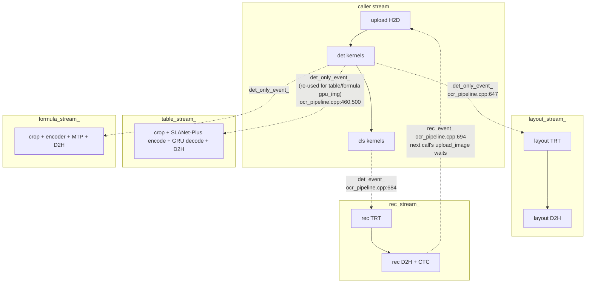
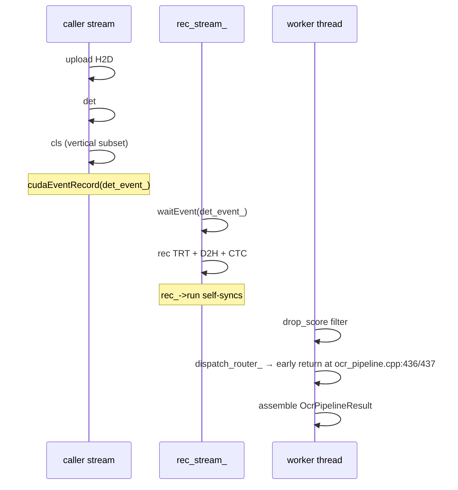
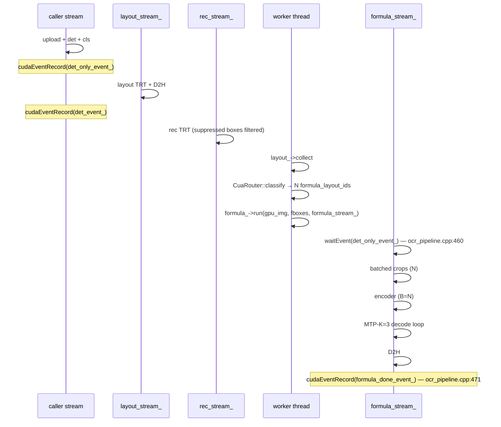
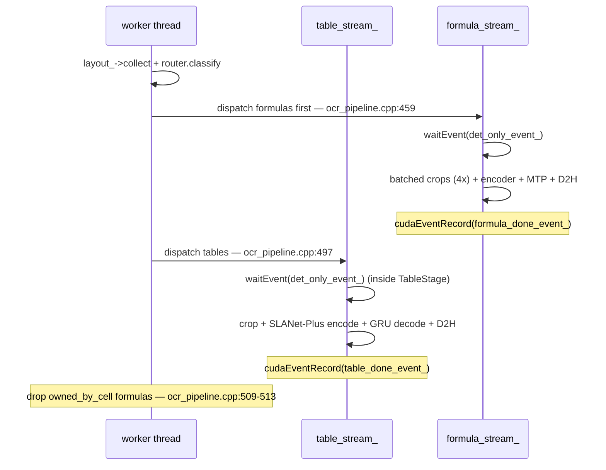

# CUDA streams

!!! warning "Historic design record"
    This page describes the **pre-merge GPU pipeline** (`OcrPipeline`,
    `ocr_pipeline.cpp`), which was retired in the 2026-07 unified
    multi-backend merge — the named stream/event members and line anchors
    below no longer exist in the tree. The fan-out/fan-in design itself
    survives: ordering is now expressed through the device-agnostic
    `DeviceQueue`/`DeviceEvent` seam
    (`include/turbo_ocr/backend/device_queue.h`), which the NVIDIA backend
    maps onto CUDA streams and events
    (`src/backends/nvidia/queue/cuda_device_queue.h`). The page is kept
    because it is the only written rationale for WHY the graph is shaped
    this way.

The design used **five named CUDA streams plus six CUDA events** to fan computation out and back in. The text-only path uses three of the streams and pays zero cost for the unused two — the constraint that the entire stream graph is engineered around.

## The five streams

| Stream | Created at | Used by | Text-only? |
|---|---|---|---|
| caller `stream` | per request | upload + det + cls | yes |
| `rec_stream_` | `init()` — `ocr_pipeline.cpp:135` | recognition | yes |
| `layout_stream_` | `load_layout_model()` — `ocr_pipeline.cpp:327` | PP-DocLayoutV3 | when layout loaded |
| `table_stream_` | `load_router_models()` — `ocr_pipeline.cpp:168` / `181` | SLANet-Plus encode + host GRU decode | no |
| `formula_stream_` | `load_router_models()` — `ocr_pipeline.cpp:203` | FormulaNet enc + MTP | no |

All four pipeline-owned streams are created with `cudaStreamNonBlocking`
so a wait on the legacy default stream cannot accidentally serialise
them.

## The six events

| Event | Recorded on | Waited on by | Purpose |
|---|---|---|---|
| `det_event_` | caller stream after cls — `ocr_pipeline.cpp:684` | `rec_stream_` — `ocr_pipeline.cpp:685` | det → rec handoff |
| `det_only_event_` | caller stream after det — `ocr_pipeline.cpp:647` | `layout_stream_`, `formula_stream_`, `table_stream_` | unblocks reads of `gpu_img` once upload+det are done |
| `rec_event_` | `rec_stream_` after rec — `ocr_pipeline.cpp:694` | next call's `upload_image` — `ocr_pipeline.cpp:398` | cross-call image-buffer reuse |
| `table_done_event_` | `table_stream_` after dispatch — `ocr_pipeline.cpp:502` | reserved for cross-call join | table-tail join |
| `formula_done_event_` | `formula_stream_` after dispatch — `ocr_pipeline.cpp:471` | reserved for cross-call join | formula-tail join |
| (layout d2h event) | `layout_stream_` after layout D2H — inside `PaddleLayout::collect()` | worker thread `cudaEventSynchronize` | host sync point |

## Stream + event graph



The dotted arrows are the only inter-stream synchronisation in the
pipeline. Everything else runs free.

## Timeline 4a — text-only page

Plan 04 §4a. No table/formula models loaded, or `want_layout=false`.



ASCII (raw plan 04 §4a):

```text
caller_stream :  [upload][===det===][cls?]↓det_only ↓det_event
layout_stream :                              ↓wait det_only [=====layout TRT=====]↓d2h
rec_stream    :                                       ↓wait det_event [========rec========]↓rec_event
worker thread :                                                                              [collect (sync)][router ≤50µs][assemble]
table_stream  :  IDLE
formula_stream:  IDLE
```

`table_stream_` and `formula_stream_` receive zero event records, zero
`cudaStreamWaitEvent`, zero kernel launches. The only new CPU work
versus the pre-router code is the two-branch short-circuit at
`ocr_pipeline.cpp:436-437`.

## Timeline 4b — page with 1 table

Plan 04 §4b. Layout loaded, page contains one `class_id=21` (table)
cell at trust tier.

```mermaid
sequenceDiagram
  participant caller as caller stream
  participant layout as layout_stream_
  participant rec as rec_stream_
  participant worker as worker thread
  participant table as table_stream_

  caller->>caller: upload H2D
  caller->>caller: det
  Note over caller: cudaEventRecord(det_only_event_) — ocr_pipeline.cpp:647
  layout->>layout: waitEvent(det_only_event_)
  layout->>layout: layout TRT + D2H
  caller->>caller: cls
  Note over caller: cudaEventRecord(det_event_)
  rec->>rec: waitEvent(det_event_) + rec TRT + D2H
  worker->>worker: drop_score filter
  worker->>worker: layout_->collect (host sync)
  worker->>worker: CuaRouter::classify
  Note over worker: has_table=true; ocr_pipeline.cpp:497
  worker->>worker: table_stage_->run dispatch
  table->>table: waitEvent(det_only_event_) (inside TableStage)
  table->>table: crop + SLANet-Plus encode + GRU decode + D2H
  Note over table: cudaEventRecord(table_done_event_) — ocr_pipeline.cpp:502
  worker->>worker: TableStage internal collect joins table_stream_
```

ASCII (plan 04 §4b):

```text
caller_stream :  [upload][===det===][cls]↓det_only ↓det_event ↓crop_src
layout_stream :                            ↓wait det_only [====layout TRT====]↓d2h
rec_stream    :                                      ↓wait det_event [=======rec=======]↓rec_event
worker thread :                                                          [collect][router][enqueue table][wait table_done]
table_stream  :                                                                  ↓wait crop_src [crop][SLANet-Plus encode][GRU decode][D2H]↓table_done
```

`crop_src_event_` from plan 04 was coalesced into `det_only_event_` per
the quick-win at plan 04 §8.1 — see `ocr_pipeline.cpp:460` and `:500`.
Both table and formula streams reuse the existing event that layout
already waits on, saving one event record per dispatch.

## Timeline 4c — page with N formulas

Plan 04 §4c. Pure formula page (e.g. math textbook spread).



ASCII (plan 04 §4c):

```text
caller_stream :  [upload][===det===][cls]↓det_only ↓det_event ↓crop_src
layout_stream :                            ↓wait det_only [===layout TRT===]↓d2h
rec_stream    :                                      ↓wait det_event [=======rec=======]↓rec_event
worker thread :                                                       [collect][router][enqueue formula batch][wait formula_done]
formula_stream:                                                          ↓wait crop_src [batched crops][batched encoder B=N][MTP decode][D2H]↓formula_done
```

N formula crops fire as one TRT batch (encoder + decoder). When
N exceeds the configured batch cap the call chunks back-to-back on
the same `formula_stream_` — no extra streams needed.

## Timeline 4d — mixed page

Plan 04 §4d. Page contains both a table cell and ≥1 formula cells.



ASCII (plan 04 §4d):

```text
worker thread :  ...[collect][router][enqueue table][enqueue formula][wait BOTH]...
table_stream  :        ↓wait crop_src [crop][SLANet-Plus encode][GRU decode][D2H]↓table_done
formula_stream:        ↓wait crop_src [batched crops 4×][encoder][MTP decode][D2H]↓formula_done
```

Total wall-clock on mixed pages = `max(det+cls+rec, det+layout +
max(table, formula))`. Formulas are dispatched before tables so the
HTML reconstructor downstream can absorb formulas that land inside
a `<td>` (and flag them `owned_by_cell` for the top-level erase pass
at `ocr_pipeline.cpp:509-513`).

## Invariants

!!! info "Plan 04 §7 — three invariants that pin the 270 ms text-only path"
    1. **No `cudaStreamWaitEvent` on `rec_stream_` for any new event.**
       `rec_stream_`'s only inbound event is the existing `det_event_`
       (`ocr_pipeline.cpp:685`). `table_stream_`, `formula_stream_`, or
       the worker thread are the only consumers of `crop_src_event_`,
       `table_done_event_`, `formula_done_event_`.
    2. **No `cudaEventRecord` on `rec_stream_` other than the existing
       `rec_event_`** (`ocr_pipeline.cpp:694`).
    3. **The router's CPU path on text-only pages calls zero CUDA APIs.**
       Branch on `(!router_)` and `(out.layout.empty())` before any
       record/wait/launch — see `ocr_pipeline.cpp:436-437`.

GPU instruction stream on text-only is bit-identical to the pre-router
code. The only added cost is CPU-side: ≤ 50 µs.

## Buffer ownership

| Buffer | Owner | Lifetime | Plan 04 ref |
|---|---|---|---|
| `gpu_img` (`img_bufs_[2]`) | `OcrPipeline`, double-buffered | grow-only across calls; reused when `rec_event_` fires | §6a |
| Crop staging (SLANet-Plus input, formula encoder ~192×448) | per modality | pool, grow-only, lazy alloc | §6b |
| Pinned host D2H (HTML / cell quads / LaTeX token IDs) | per modality | `cudaHostAlloc(cudaHostAllocDefault)` — readback, NOT write-combined | §6c |
| Pinned upload (`h_pinned_buf_`) | `OcrPipeline` | `cudaHostAllocWriteCombined` — upload only — `ocr_pipeline.cpp:418` | n/a |
| Per-page region caps | `kMaxTableRegionsPerPage=4`, `kMaxFormulaPerPage=32` | chunk on same stream if exceeded | §6d |

Table/formula must **not retain a reference to `gpu_img` past their crop
kernel**. The next call's `upload_image` will overwrite that buffer as
soon as `rec_event_` fires; table/formula keep their own crop tensors
alive through the rest of their pipeline.

## Risks tracked from plan 04 §9

1. **Accidentally waiting on `table_done_event_` in `upload_image` on
   text-only.** Mitigation: `upload_image` waits only on `rec_event_`
   (`ocr_pipeline.cpp:398`); `table_done_event_` /
   `formula_done_event_` are recorded but not consumed there. If a
   future change wires a consolidated `prev_call_done_event_`, the
   short-circuit must reset it to `rec_event_` for text-only pages.
2. **TRT engine context construction for table/formula models steals
   SM/PCIe at warmup, regressing first-N requests.** Mitigation: warm
   these engines in `warmup_gpu()` (`ocr_pipeline.cpp:333`) with dummy
   crops, mirroring the 5-bucket rec warmup loop at
   `ocr_pipeline.cpp:346`.
3. **Router CPU cost balloons (allocs, `std::sort`, RTTI).**
   Mitigation: `CuaRouter` keeps reusable scratch members
   (`decisions_`, `layout_aabbs_`, `overlap_`) and `RoutingPlan plan_`
   on `OcrPipeline` (`ocr_pipeline.h:237`) so the hot path doesn't
   re-allocate. Track via `PipelineTimer router_classify` segment
   started at `ocr_pipeline.cpp:439`.
4. **`cudaEventRecord` / `cudaStreamWaitEvent` syscalls add up.** At
   most four new CUDA API calls per dispatch (≈ 5 µs). The real risk
   is per-region calls — avoided by modality-level batching (one
   `formula_->run` for all N formula crops on the page).
5. **Layout TRT latency increases, becomes critical on text-only.**
   Mitigation: `want_layout=false` bypasses the router branch entirely
   (`ocr_pipeline.cpp:437`). If layout > rec, defer pixel-level layout
   post-processing past the router dispatch.

## Code references

Event records on the caller stream:

```cpp
// ocr_pipeline.cpp:647 — layout_active path, after det
CUDA_CHECK(cudaEventRecord(det_only_event_, stream));
CUDA_CHECK(cudaStreamWaitEvent(layout_stream_, det_only_event_, 0));

// ocr_pipeline.cpp:684 — after cls, gates rec
CUDA_CHECK(cudaEventRecord(det_event_, stream));
CUDA_CHECK(cudaStreamWaitEvent(rec_stream_, det_event_, 0));
```

Rec → next-call handoff:

```cpp
// ocr_pipeline.cpp:694 — recorded after dispatch_rec_ returns
CUDA_CHECK(cudaEventRecord(rec_event_, rec_stream_));

// ocr_pipeline.cpp:398 — top of next upload_image
CUDA_CHECK(cudaEventSynchronize(rec_event_));
```

Formula + table dispatch (router-only, never on text-only):

```cpp
// ocr_pipeline.cpp:460 — formula gate
CUDA_CHECK(cudaStreamWaitEvent(formula_stream_, det_only_event_, 0));
// ... formula_->run on formula_stream_ ...
// ocr_pipeline.cpp:471
CUDA_CHECK(cudaEventRecord(formula_done_event_, formula_stream_));

// ocr_pipeline.cpp:498-502 — table gate is inside TableStage::run,
// which takes det_only_event_ as an explicit arg
out.tables = table_stage_->run(gpu_img, out.layout, out.results,
                               out.formulas, table_stream_,
                               det_only_event_);
CUDA_CHECK(cudaEventRecord(table_done_event_, table_stream_));
```

!!! info "See also"
    - [Pipeline](pipeline.md) — `run_with_layout` walked top-to-bottom with stage-to-stream attribution.
    - [Router](router.md) — what runs between `layout_->collect()` and the table / formula gates.
    - [Model Interactions](../models/interactions.md) — the same sequence as cross-class messages instead of stream lanes.
