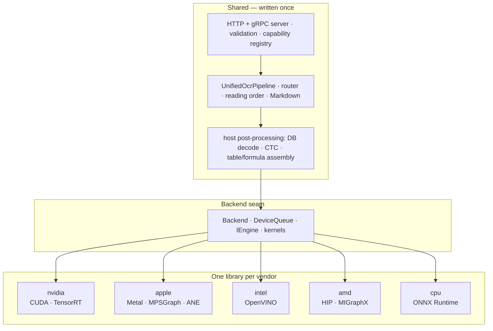

# Architecture overview

TurboOCR v4 is **one pipeline over a device seam**. A single orchestration —
`UnifiedOcrPipeline` — runs detection, angle classification, recognition and
the opt-in structure stages against an abstract `Backend`; each vendor
supplies one backend library (device memory, queues, kernels, an inference
engine), and everything above that line — HTTP/gRPC serving, validation,
routing, reading order, Markdown export, serialization — is written once and
shared by every vendor.

The v4 rebuild was gated on the NVIDIA server's output staying
**byte-identical** through the merge, so the shared orchestration is proven
against the previously shipped pipeline, not merely equivalent on paper.

## The text-only fast path

The most important invariant survived the rebuild unchanged: the text path
(`upload → det → cls → rec`) pays **zero cost** for the structure stages.
Layout, table and formula models are opt-in at load time and gated per
request; on a text-only run the router returns before any device API call,
so a pipeline that never loads them executes the same device instruction
stream as one that has them disabled. This is what lets one server offer
full document parsing while whole-page OCR still measures 650+ img/s on an
RTX 5090 and single-page latency stays in single-digit milliseconds
([benchmarks](../benchmarks/comparison.md), [latency](../benchmarks/latency.md)).

## Engine modes: native vs onnx

Every vendor backend can offer two paths to its silicon
(`include/turbo_ocr/backend/engine_mode.h`):

| Mode | Meaning | Examples |
|---|---|---|
| `native` / `ultra` | the vendor's own graph engine — fastest, needs a built artefact | TensorRT engines · MPSGraph exports · OpenVINO compiled graphs · MIGraphX `.mxr` |
| `onnx` / `fast` | the shipped `.onnx` on ONNX Runtime with the vendor's execution provider — no build step | CUDA EP · CoreML EP · OpenVINO EP · ROCm EP |

`auto` (the default) takes the native path when its artefact exists and
falls back otherwise. The fast path is one shared implementation; only the
execution provider differs per vendor.

## Why TensorRT on NVIDIA

The native NVIDIA engine is TensorRT rather than ONNX Runtime's CUDA EP
because TRT picks architecture-specific kernels (sm_120 on Blackwell) at
engine-build time, which is where the measured 15–90× lead over other OCR
engines comes from. The trade-off is paid once at startup: engines are
compiled on first run and cached. Recognition uses the shared
**nine-bucket** width ladder (`320 … 4000`, `kRecWidthBuckets`), warmed at
load so no request ever pays a first-bucket JIT.

Within the NVIDIA backend, per-stage CUDA streams and events keep stages
from serialising on each other. On every backend the same ordering is
expressed through the device-agnostic `DeviceQueue`/`DeviceEvent` seam,
which CUDA maps onto streams and events, Metal onto command buffers, HIP
onto hipStreams, and the CPU backend onto synchronous no-ops. The
pre-merge stream/event design is preserved as a historic record in
[CUDA Streams](cuda-streams.md).

## Stage availability and capabilities

Every non-text stage is opt-in at load time and discoverable at run time:

- The **capability registry** (`capability_table.def`) drives one row per
  capability across HTTP, gRPC and Python, so `/capabilities` and the
  request validators can never disagree about what a server supports.
- Requesting a stage the server was not started with is a hard `400`
  (`TABLE_BACKEND_DISABLED`, …), never a silent empty result.
- The **router** assigns layout regions to their owning stage — see
  [Router](router.md) for the class → stage mapping.

## Where things live

| Layer | Path |
|---|---|
| Shared orchestration | `src/pipeline/unified/` |
| Backend seam | `include/turbo_ocr/backend/` |
| Vendor backends | `src/backends/{nvidia,apple,intel,amd,cpu}/` |
| Server (HTTP + gRPC) | `src/service/` |
| Host analysis (det/rec/table/formula post) | `src/analysis/`, `src/document/` |
| Python bindings | `src/service/python/`, `python/` |

!!! info "See also"
    - [Pipeline](pipeline.md) — the node-by-node walk of a request.
    - [Multi-backend](multi-backend.md) — the seam design and the per-vendor split.
    - [Router](router.md) — how layout classes route to text / table / formula.
    - [What changed in v4](../guides/upgrading-v4.md) — the rebuild, summarized.
