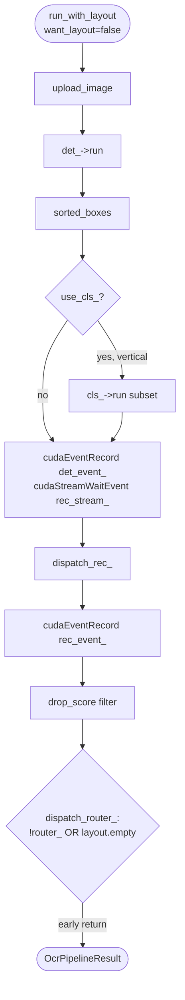

# Pipeline

`UnifiedOcrPipeline::run_with_layout()`
(`src/pipeline/unified/unified_ocr_pipeline.cpp:280`) is the single entry
point that all production callers — HTTP routes, gRPC handlers, PDF mode —
fan into. This page walks it stage by stage.

The overload `run()` (`unified_ocr_pipeline.cpp:277`) is a thin shim that
returns `run_with_layout(img).results` — the only practical difference is
which short-circuits fire. See
[the second diagram](#text-only-path) at the bottom for that path.

!!! note "Historic anchors below"
    The per-stage sections that follow were written against the pre-merge
    GPU pipeline (`ocr_pipeline.cpp`, members like `img_bufs_` /
    `rec_event_`), retired in the 2026-07 unified merge. The STAGE ORDER
    and the reasoning still describe what the unified pipeline does; the
    device choreography now lives behind the `DeviceQueue` seam, with the
    NVIDIA specifics in `src/backends/nvidia/`. Treat file:line anchors in
    those sections as historic.

## `run_with_layout` — the full graph

```mermaid
flowchart TD
  Start([run_with_layout<br/>cv::Mat img, want_layout, want_reading_order])
  Start --> Upload["upload_image<br/>ocr_pipeline.cpp:624<br/>waits rec_event_, toggles img_bufs_, H2D"]
  Upload --> Det["det_->run<br/>ocr_pipeline.cpp:626<br/>caller stream"]
  Det --> Sort["sorted_boxes<br/>ocr_pipeline.cpp:639<br/>CPU, top-to-bottom"]

  Sort --> LayoutCheck{layout_active?}
  LayoutCheck -- yes --> RecDetOnly["cudaEventRecord det_only_event_<br/>ocr_pipeline.cpp:647"]
  RecDetOnly --> WaitDetOnly["cudaStreamWaitEvent<br/>layout_stream_,det_only_event_<br/>ocr_pipeline.cpp:648"]
  WaitDetOnly --> LayoutEnq["layout_->enqueue<br/>ocr_pipeline.cpp:650<br/>layout_stream_"]
  LayoutCheck -- no --> ClsCheck

  Sort --> ClsCheck{use_cls_?}
  ClsCheck -- yes, vertical --> Cls["cls_->run on vertical subset<br/>ocr_pipeline.cpp:671"]
  ClsCheck -- no --> RecHandoff
  Cls --> RecHandoff

  LayoutEnq --> RecHandoff["cudaEventRecord det_event_<br/>+ cudaStreamWaitEvent rec_stream_<br/>ocr_pipeline.cpp:684-685"]
  RecHandoff --> Rec["dispatch_rec_<br/>ocr_pipeline.cpp:687<br/>rec_stream_"]
  Rec --> RecEvent["cudaEventRecord rec_event_<br/>ocr_pipeline.cpp:694"]

  RecEvent --> Filter["drop_score filter<br/>build OCRResultItem[]<br/>ocr_pipeline.cpp:700-712"]
  Filter --> LayoutCollect{layout_active?}
  LayoutCollect -- yes --> Collect["layout_->collect<br/>ocr_pipeline.cpp:719<br/>HOST SYNC POINT"]
  LayoutCollect -- no --> Router
  Collect --> Router

  Router["dispatch_router_<br/>ocr_pipeline.cpp:724"]
  Router --> RouterShort{router_ &amp;&amp; !layout.empty?}
  RouterShort -- no --> ROCheck
  RouterShort -- yes --> Classify["CuaRouter::classify<br/>cua_router.cpp:382<br/>CPU only"]
  Classify --> FormulaCheck{has_formula?}
  FormulaCheck -- yes --> FormulaWait["wait det_only_event_<br/>formula_->run on formula_stream_<br/>ocr_pipeline.cpp:460-471"]
  FormulaCheck -- no --> TableCheck
  FormulaWait --> TableCheck
  TableCheck{has_table?}
  TableCheck -- yes --> TableRun["table_stage_->run<br/>on table_stream_<br/>ocr_pipeline.cpp:498"]
  TableCheck -- no --> AbsorbDrop
  TableRun --> AbsorbDrop["drop owned_by_cell formulas<br/>ocr_pipeline.cpp:509-513"]

  AbsorbDrop --> ROCheck{want_reading_order &amp;&amp; layout?}
  ROCheck -- yes --> RO["assign_layout_ids + assign_reading_order<br/>ocr_pipeline.cpp:731-733"]
  ROCheck -- no --> Done
  RO --> Done([OcrPipelineResult])
```

## Stage-by-stage

### upload_image — `ocr_pipeline.cpp:396`

Waits on `rec_event_` (`ocr_pipeline.cpp:398`) so the previous call's
recognition has released its source buffer, then toggles the double-
buffered `img_bufs_[0/1]` so the next H2D doesn't race the in-flight
read. Grow-only `cudaMallocPitch`, write-combined pinned staging
(`cudaHostAllocWriteCombined` — `ocr_pipeline.cpp:418`), one async
2D memcpy. Returns a `GpuImage` view (pointer + pitch + dims) — the
buffer stays owned by the pipeline.

### Detection — `det_->run` (`ocr_pipeline.cpp:626`)

PaddleDet (DBNet-derived) on the caller's stream. Returns axis-aligned
text boxes in the original image coordinate system. Degenerate inputs
(e.g. 1×1, zero-pitch crashes inside `cudaMemcpy2DAsync`) are caught at
`ocr_pipeline.cpp:628`: stream is reset, sticky error cleared, an empty
result returned — the bad request doesn't poison subsequent ones.

### sorted_boxes — `ocr_pipeline.cpp:639`

Pure CPU, in-place top-to-bottom-then-left-to-right sort. Sets the
indexing order every downstream stage uses.

### Layout (optional) — `ocr_pipeline.cpp:646-652`

Only when `use_layout_ && want_layout`. Records `det_only_event_` on
the caller stream, then `cudaStreamWaitEvent` makes `layout_stream_`
wait on it. PP-DocLayoutV3 enqueues async on `layout_stream_` and
overlaps with cls + rec — the host-side `collect()` is deferred until
after rec returns.

### Angle classification (optional) — `ocr_pipeline.cpp:656-678`

`PaddleCls` runs only on boxes flagged vertical by `is_vertical_box`
(h ≥ w·1.5). Selective dispatch avoids paying classifier latency on
horizontal text, which is the vast majority of input.

### Det → rec handoff — `ocr_pipeline.cpp:684-685`

`cudaEventRecord(det_event_, stream)` then
`cudaStreamWaitEvent(rec_stream_, det_event_, 0)` — proper data
dependency without a full `cudaStreamSynchronize`. This is the event
pair that enables det/rec overlap **across calls**: call N+1's
upload+det runs on the caller stream while call N's rec tail is still
executing on `rec_stream_`.

### Recognition — `dispatch_rec_` (`ocr_pipeline.cpp:687`)

The fast path (`ocr_pipeline.cpp:535`: `rec_engines_.size() == 1 &&
!script_id_`) is bit-identical to single-engine: one PaddleRec call.
Multi-script: optional ScriptId classification picks a per-box script,
boxes are grouped by clamped script (confidence < 0.6 → first loaded
language), per-script PaddleRec runs, results merged in input order.

`rec_event_` is recorded on `rec_stream_` immediately after dispatch
(`ocr_pipeline.cpp:694`). Note: `rec_->run()` self-syncs `rec_stream_`
for D2H + CTC decode, so by the time control returns to the worker
thread `rec_stream_` is already idle and the event is "done" — it's
kept as a correctness guard and as a hook for future fully-async rec.

### Drop-score filter — `ocr_pipeline.cpp:700-712`

Rec results below `kDropScore` or with empty text are dropped before
the boxed result vector is built.

### Layout collect — `ocr_pipeline.cpp:719`

`layout_->collect()` `cudaEventSynchronize`s on the layout D2H event
and is the final GPU sync point on the worker thread (plan 04 §2). On
text-only-plus-layout pages, by the time it returns, rec is also done,
so the router runs on a fully quiesced GPU.

### Router + dispatch — `dispatch_router_` (`ocr_pipeline.cpp:430-515`)

Three short-circuits, in order — every one bails before any new CUDA
API call (plan 04 §7):

1. `if (!router_) return;` — `load_router_models()` was never called.
2. `if (out.layout.empty()) return;` — `want_layout=false` or layout
   model not loaded.
3. After `router_->classify(...)`: `if (!has_table && !has_formula)
   return;` — pure-text page; no table/formula cells emitted.

Past the third short-circuit, formula dispatch comes first
(`ocr_pipeline.cpp:459-490`) so the table HTML reconstructor can
absorb formulas that fall inside a `<td>`. Then table dispatch
(`ocr_pipeline.cpp:497-503`). `formula_stream_` and `table_stream_`
each wait on `det_only_event_` before reading `gpu_img`; each
records its own `*_done_event_` after dispatch. Formulas absorbed
into a cell are erased from the top-level array
(`ocr_pipeline.cpp:509-513`) so OmniDocBench scoring doesn't
double-count.

### Reading order (optional) — `ocr_pipeline.cpp:730-734`

When `want_reading_order=true` and a non-empty layout exists,
`assign_layout_ids()` maps each result to its owning cell and
`assign_reading_order_for_results()` runs PaddleX's XY-cut over the
layout regions (with synthetic entries for orphan results so unmatched
detections still land in the right spot).

## Text-only path

When `want_layout=false`, the diagram collapses dramatically. Every
optional branch fails its guard.

- `layout_active = use_layout_ && want_layout` is false → the
  `if (layout_active)` blocks at `ocr_pipeline.cpp:646` and
  `ocr_pipeline.cpp:718` are skipped, including the
  `det_only_event_` record and the `layout_stream_` wait.
- `out.layout` stays empty → `dispatch_router_` returns at
  `ocr_pipeline.cpp:437` before touching CUDA.
- `want_reading_order` is irrelevant — the layout check at
  `ocr_pipeline.cpp:730` is `false`.

The GPU instruction stream is byte-identical to the pre-router
codebase. This is what the 270 ms invariant rests on.

!!! info "See also"
    - [CUDA Streams](cuda-streams.md) — the same flow drawn as swimlanes with event handoffs.
    - [Router](router.md) — the CPU stage between `layout->collect()` and the table / formula gates.
    - [Architecture overview](overview.md) — the 270 ms invariant and the design pressures behind it.
