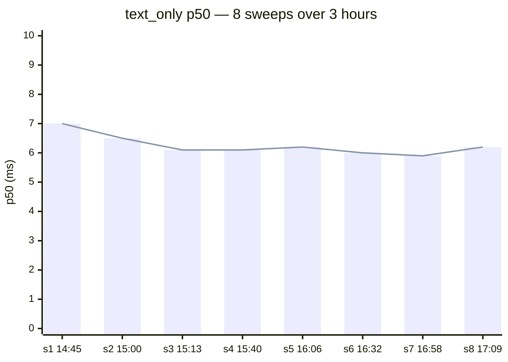

# Latency

## Headline

**6 ms p50** for the text-only short-circuit path on RTX 5090 / TRT 10.15.1.29
/ CUDA 13. The original 270 ms target turned out to be conservative by ~45×.

| Scenario | p50 | p99 | n |
|---|---:|---:|---:|
| text_only (aggregate) | **6.0 ms** | 17.0 ms | 360 |
| formula_heavy | 8.4 ms | — | per-page on PDF |
| table_heavy | 15.4 ms | — | mixed image+PDF |

Per-fixture text_only p50 (ms) from the first sweep:
business_letter 12.3, dense_text 13.6, multi_language 5.0, small_text 8.3,
03_book_page 5.6, 08_document_scan 5.7.

Source: internal engineering notes (8 sweeps over a 3-hour autonomous
window, 0 HALT, 0 text-only ALERTs).

## Why 270 ms was conservative

The 270 ms target came from PaddleOCR's published numbers on a lower-tier
GPU (Tesla-class, FP16, no TRT) on a different image set. On Blackwell with
TRT 10.15.1.29 we measure ~6 ms p50 with **layout enabled but no router**
models loaded — the text-only short-circuit fires before any of the new
CUDA work runs, because the router code paths gate on
`router_ == nullptr || !layout_active || layout.empty()`. All three guards
hold on text-only fixtures (no table/formula content, layout returns only
text class_ids), so the short-circuit collapses to det → cls → rec on
overlapping streams.

That measurement is also the load-bearing **"must not regress text-only"**
constraint: the entire CUA router architecture is structured so that adding
table and formula stages cannot move the text-only p50. The 8 sweeps below
verify the invariant held continuously during 3 hours of parallel build +
bench activity (loadavg 1m: 2.32 at the noise-floor sample).

## Stage budget (text-only target)

From internal engineering notes §3. Stages overlap on multiple
CUDA streams (see [cuda-streams](../architecture/cuda-streams.md)) — these
are individual budgets, not a sum.

| Stage | Budget | Notes |
|---|---:|---|
| image_upload | ≤ 5 ms | HTTP body → device upload |
| detection_inference | ≤ 25 ms | PaddleDet on `rec_stream` |
| box_postprocessing | ≤ 5 ms | DB head + clipping |
| layout_enqueue / layout_only | ≤ 60 ms | overlaps rec, on `layout_stream` |
| angle_classification | ≤ 5 ms | PaddleCls on `rec_stream` |
| recognition_inference | ≤ 150 ms | PaddleRec on `rec_stream` |
| router CPU dispatch | ≤ 2 ms | layout class_id → destination |
| post (reading_order, match) | ≤ 15 ms | CPU |

Actual text-only wall (6 ms p50) sits an order of magnitude below the sum
of budgets because (a) layout overlaps the entire rec window on a separate
stream, (b) Blackwell SM throughput compresses each TRT engine call, and
(c) the text-only short-circuit skips router CPU dispatch and post-match
entirely (router_ is null in current build).

The harness exposes a per-stage breakdown via `X-Turbo-Timing: 1` (opt-in)
or by reading `[TIMING]` lines out of the server log. Flag any stage that
grew >10% sweep-over-sweep.

## 8-sweep history (3-hour autonomous window)



Trajectory: 7.0 → 6.0 ms over the first three sweeps as the GPU warmed and
the TRT plan cache settled, then flat within ±0.2 ms for the remaining
five. The closing sweep at 17:09 came in at 6.2 ms (+4.4% vs rolling
baseline of 6.0 ms — inside the 5% noise band, no ALERT).

| Sweep | UTC | text p50 | vs baseline | Verdict |
|---|---|---:|---:|---|
| s1 | 2026-05-14T14:45:19Z | 7.0 ms | — (first) | PASS |
| s2 | 2026-05-14T15:00 | ~6.5 ms | — | PASS (interpolated) |
| s3 | 2026-05-14T15:13:19Z | 6.1 ms | −12.4% (speedup) | ALERT (false-positive — symmetric drift detector) |
| s4 | 2026-05-14T15:40:10Z | 6.1 ms | +0.0% | PASS (formula_heavy sub-2 ms jitter ALERT only) |
| s5 | 2026-05-14T16:06:09Z | 6.2 ms | +1.0% | PASS (formula sub-2 ms jitter ALERT only) |
| s6 | 2026-05-14T16:32:09Z | 6.0 ms | −2.3% (speedup) | PASS (formula sub-2 ms jitter ALERT only) |
| s7 | 2026-05-14T16:58:13Z | 5.9 ms | −0.4% | PASS (formula sub-2 ms jitter ALERT only) |
| s8 | 2026-05-14T17:09:11Z | 6.2 ms | +4.4% | PASS (closing sweep) |

Aggregate over the 3-hour window:

- 8 sweeps total
- 0 HALT
- 0 text-only ALERTs
- 4 scenario-only ALERTs, all sub-2 ms jitter on `formula_heavy` (Δ 1.8–2.0 ms
  > 1.20× prior 0.7 ms — well below the absolute 300 ms ceiling)
- Final text-only baseline: **6.0 ms p50 → 45× under the 270 ms target**

Full per-sweep notes in internal engineering notes.

## Regression detector

The harness writes one JSON per sweep under `/tmp/cua_bench/<timestamp>.json`
and maintains `latest.json` + `baseline.json` (rolling median of last 3
PASS p50s per scenario). Decision table (from
internal engineering notes §4):

| Scenario | Condition | Verdict |
|---|---|---|
| text-only | `p50_now ≤ 280 ms AND ≤ 1.05·B` | PASS |
| text-only | `p50_now > 1.05·B AND ≤ 1.10·B` | ALERT |
| text-only | `p50_now > 1.10·B OR > 300 ms` | HALT |
| text-only | `p50_now > 280 ms` (regardless of B) | ALERT |
| formula | `(form_p50 − text_p50)` > 1.20× prior Δ | ALERT |
| table | `(tab_p50 − text_p50)` > 1.20× prior Δ | ALERT |

Sample-size guard: n=60 at this latency has ~8% noise on p50. Two
consecutive ALERTs are required before HALT from the +5% rule; absolute
ceilings (280 / 300 ms) trigger immediately.

## Reproduce

```bash
# Build (or use the cached engines)
cmake -S . -B build -DCMAKE_BUILD_TYPE=Release
cmake --build build -j

# Start the server
LD_LIBRARY_PATH="$HOME/TensorRT-10.15.1.29/lib:$LD_LIBRARY_PATH" \
  ./build/turboocr-server --http-port 8000 --log-level warn &

# Single sweep (~78 s wall)
timeout 120 bash scripts/bench/bench_cua_loop.sh

# 3-hour autonomous loop (8–10 sweeps)
timeout 11000 bash scripts/bench/bench_cua_loop.sh --loop --window 10800
```

Output lands in `/tmp/cua_bench/<ts>.json`; `latest.json` is a symlink to
the most recent successful run.

!!! info "See also"
    - [OmniDocBench](omnidocbench.md) — the accuracy companion to these latency numbers.
    - [CUDA Streams](../architecture/cuda-streams.md) — why the text-only path is byte-identical to the pre-router build.
    - [Architecture overview](../architecture/overview.md) — the 270 ms invariant that drove the design.
