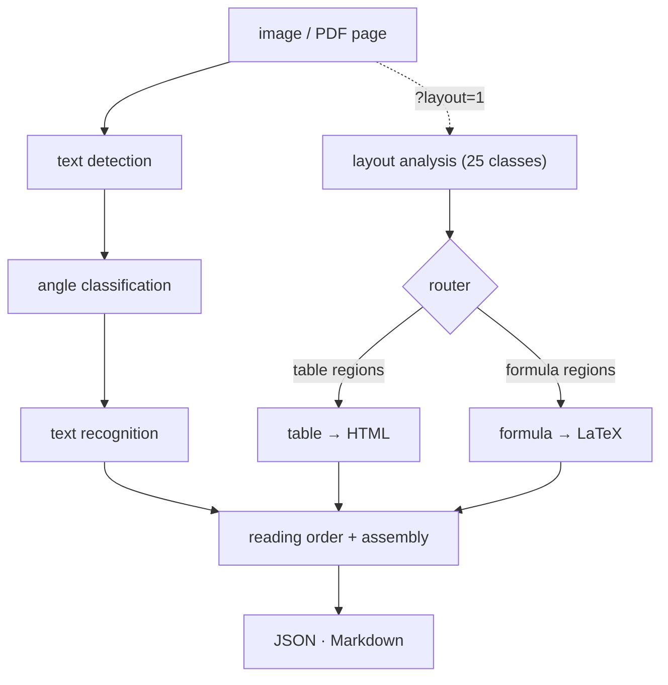

# TurboOCR

The fastest GPU document parser — OCR, layout, tables and formulas to
Markdown, in one device-resident C++ pipeline behind HTTP, gRPC and Python.
Fully local: no vision-language model, no external API.

[Install — pick your hardware](getting-started/install.md){ .md-button .md-button--primary }
[Benchmarks](benchmarks/comparison.md){ .md-button }
[GitHub](https://github.com/aiptimizer/TurboOCR){ .md-button }

v4 alpha · NVIDIA · Apple Metal + Neural Engine · Intel OpenVINO · AMD ROCm · CPU · AMD is not yet hardware-tested

  
650+

  
img/s · FUNSD forms

  
whole-page OCR, one RTX 5090

  
200+

  
img/s · OmniDocBench

  
dense documents, one RTX 5090

  
20

  
pages/s · full parse

  
layout + tables + formulas → Markdown

  
91.9%

  
FUNSD word-F1 · medium tier

  
highest of every engine measured

-   __[Install — pick your hardware](getting-started/install.md)__

    ---

    Click your hardware — NVIDIA, Apple Silicon, Intel, AMD, CPU or the
    Python library — and get a complete path from zero to a first OCR
    response.

-   __[Benchmarks](benchmarks/comparison.md)__

    ---

    Every engine on identical pages, ≥15 s timed windows, dual-clock
    cross-check: throughput and word-F1 against PaddleOCR, PaddleOCR-VL,
    RapidOCR, EasyOCR and Tesseract.

-   __[API reference](reference/http.md)__

    ---

    HTTP endpoints (`/ocr/raw`, `/ocr/pdf`, `/ocr/markdown`,
    `/ocr/stream`, …), the gRPC twins generated from `proto/ocr.proto`,
    the [Python library](reference/python.md), and every environment
    variable.

-   __[Models](models/selection.md)__

    ---

    Per-stage model cards — detection, recognition, classification,
    layout, table, formula — with sizes, tiers, and how each stage is
    selected and enabled.

-   __[Python library](getting-started/install.md)__

    ---

    The C++ pipeline behind a native wheel with a built-in replica pool:
    `OCR(replicas=3)` reaches server-class throughput from one object.

-   __[Architecture](architecture/overview.md)__

    ---

    One unified pipeline over a device seam, one backend library per
    vendor, and why the text-only fast path stays byte-identical while
    the structure stages fan out.

## How a page flows

The text path always runs: detection finds the lines, the angle classifier
de-rotates them, recognition reads every crop. Layout is opt-in per
request; when enabled, the router hands its table and formula regions to
their recognizers, and assembly merges everything in reading order. Pages
that ask for text only never touch the structure stages. The node-by-node
walk is in [Architecture → Pipeline](architecture/pipeline.md).

## What changed in v4

v4 replaced the separate CUDA and CPU pipelines with **one** orchestration
over a device-agnostic backend seam — NVIDIA output stayed byte-identical
through the rebuild, and Apple (Metal + Neural Engine), Intel (OpenVINO),
AMD (ROCm) and the Python library all run the same engine. The full list is
in [What changed in v4](guides/upgrading-v4.md).
