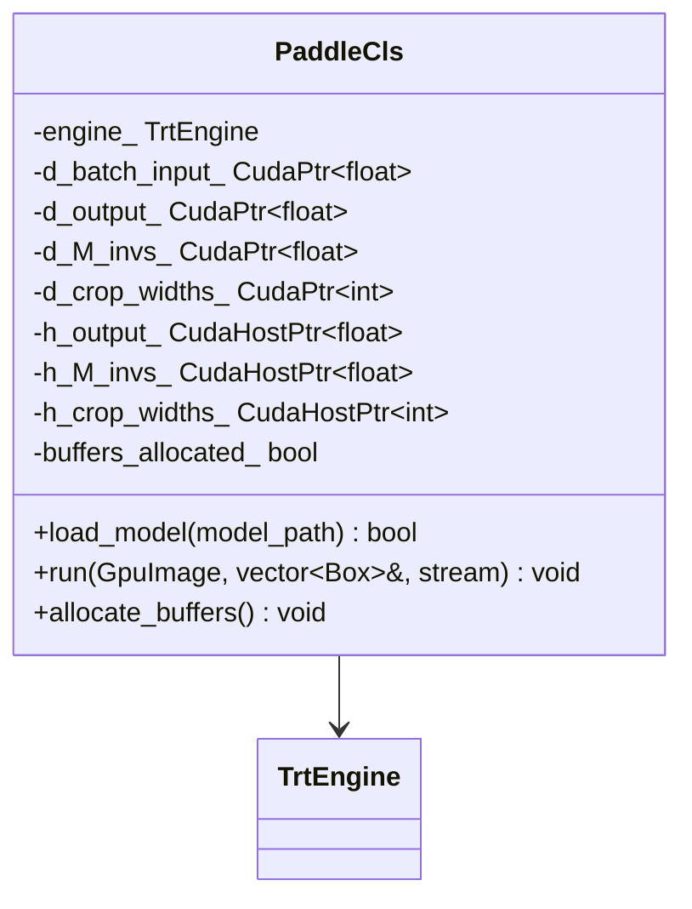
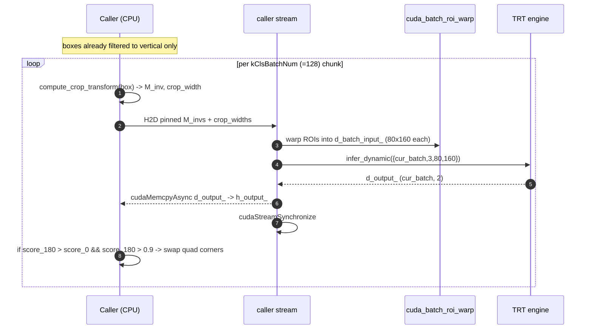

# Classification — `PaddleCls`

Per-line angle classifier. By default it runs **only** on detection boxes that
look vertical
(`h >= 1.5 * w`, see [`is_vertical_box`](https://github.com/aiptimizer/TurboOCR/blob/main/include/turbo_ocr/common/types.h))
and decides whether each crop should be flipped 180° before recognition. Most
horizontal text never touches this stage, which is why the latency cost is
typically <0.5 ms on a page with ~100 lines.

Two opt-ins change this (see [Configuration](../reference/configuration.md)):

- **`CLS_ALL_BOXES=1`** classifies **every** crop instead of only vertical-looking
  ones. Detection geometry gives each line's axis but cannot spot an upside-down
  *horizontal* line, so scans with mixed per-line orientations need this. Cost on
  OmniDocBench text-only throughput: ~−1% (`tiny`) to ~−0% (`medium`).
- **`CLS_ONNX=x1_0`** (CPU: `CLS_MODEL=x1_0`) swaps in the full-width
  **PP-LCNet_x1_0** textline-orientation variant (`models/cls_x1_0.onnx`, ~6.8 MB,
  identical I/O contract). Slightly better flip decisions on hard crops at ~−10%
  text-only throughput when combined with `CLS_ALL_BOXES=1`; the default `x0_25`
  remains the recommended tradeoff. Export recipe:
  [`scripts/models/onnx/export_textline_ori_x1_0.py`](https://github.com/aiptimizer/TurboOCR/blob/main/scripts/models/onnx/export_textline_ori_x1_0.py).

## Why this design

Plain CRNN recognition assumes upright glyphs. Document scans (especially
business letters, forms, and CJK column text) routinely contain lines that
the detector finds but renders bottom-up. Recognizing those without flipping
yields nonsense. Two design choices keep the cost negligible:

1. **Selective dispatch** — `OcrPipeline::run_with_layout`
   ([`ocr_pipeline.cpp:656-678`](https://github.com/aiptimizer/TurboOCR/blob/main/src/pipeline/unified/unified_ocr_pipeline.cpp))
   filters to vertical boxes first, then passes only that subset to `cls_->run`.
2. **In-place quad rotation** — when score₁₈₀ > score₀ and exceeds
   `kClsThresh = 0.9` ([`paddle_cls.h:40`](https://github.com/aiptimizer/TurboOCR/blob/main/include/turbo_ocr/models/classification/paddle_cls.h)),
   the box's corner array `[tl, tr, br, bl]` is swapped via two
   `std::swap` calls
   ([`paddle_cls.cpp:91-96`](https://github.com/aiptimizer/TurboOCR/blob/main/src/models/classification/paddle_cls.cpp)). The
   recognizer then warps the rotated quad and the text comes out upright. No
   image data is moved.

## Model card

| Field | Value |
| --- | --- |
| ONNX path | `models/cls.onnx` (PP-OCRv5 textline orientation, PP-LCNet_x0_25) |
| Engine cache key | `cls_<gpu>_<trt_version>.plan` |
| Input tensor | `x : (N, 3, 80, 160)` float32, BGR, ImageNet-normalised |
| Dynamic profile | MIN `(1,3,80,160)` · OPT `(64,3,80,160)` · MAX `(128,3,80,160)` |
| Output tensor | `(N, 2)` float32 — `[score_0, score_180]` |
| Precision | FP16 |
| Batch | `kClsBatchNum = 128` ([`paddle_cls.h:33`](https://github.com/aiptimizer/TurboOCR/blob/main/include/turbo_ocr/models/classification/paddle_cls.h)) |
| Flip threshold | `kClsThresh = 0.9` ([`paddle_cls.h:40`](https://github.com/aiptimizer/TurboOCR/blob/main/include/turbo_ocr/models/classification/paddle_cls.h)) |

The v5 input shape `80×160` is **not** the same as the v4 shape `48×192`. The
v4 shape used to work in the TRT pipeline only because the engine was built
with a dynamic-shape profile; CPU ONNX Runtime rejects it
([`paddle_cls.h:36-40`](https://github.com/aiptimizer/TurboOCR/blob/main/include/turbo_ocr/models/classification/paddle_cls.h)).

## Latency budget

Pipeline-wide angle-classification cost is below the timer's noise floor on
the bench-diary text-only sweeps. The cost is bounded by `(N_vertical / 128) ×
~0.3 ms` per batch on RTX 5090. On typical English pages `N_vertical ≈ 0` and
the stage is skipped entirely.

## C++ surface

`compute_crop_transform` (in `turbo_ocr/common/geometry/perspective.h`) produces the
`M_inv` 3×3 matrix that lets a single CUDA kernel (`cuda_batch_roi_warp`) warp
the quad directly into the classifier's fixed `80×160` input slot without an
intermediate crop allocation.

## Per-image flow

`run(...)` is at
[`paddle_cls.cpp:44-98`](https://github.com/aiptimizer/TurboOCR/blob/main/src/models/classification/paddle_cls.cpp). The stream
sync inside the loop is intentional: the next batch needs the rotation decisions
to be visible before it begins recomputing transforms, and the work is small
enough that overlapping batches inside cls would not change wall-clock.

## Where it plugs in

Called between `PaddleDet` and `PaddleRec` on the **caller stream** (not
`rec_stream_`). After cls, `det_event_` is recorded so `rec_stream_` can start
recognition without blocking the caller stream — see
[CUDA Streams](../architecture/cuda-streams.md).

!!! info "See also"
    - [Detection](detection.md) — the upstream stage that produces the boxes cls rotates.
    - [Recognition](recognition.md) — the downstream stage gated on `det_event_`.
    - [CUDA Streams](../architecture/cuda-streams.md) — caller / `rec_stream_` swimlane and the cls→rec handoff.
