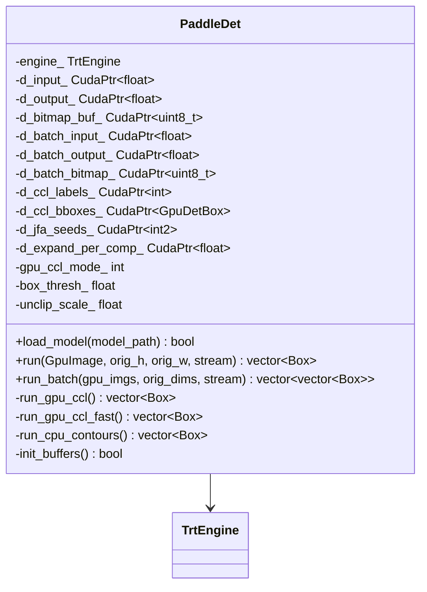
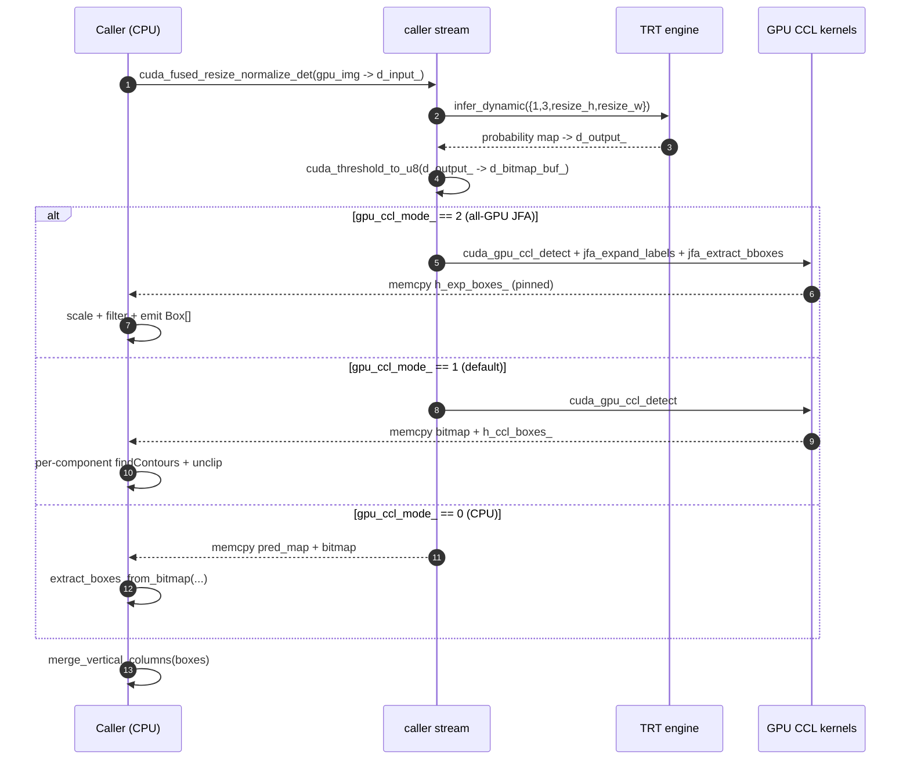

# Detection — `PaddleDet`

The first stage of every OCR call. Locates text-bearing pixels and emits
quadrilateral boxes for the downstream recognizer. Everything else in the
pipeline runs only on what `PaddleDet` decides is text — false negatives here
are unrecoverable, so the detector runs at full input resolution capped only by
the shared resize policy (`{"min", 64, max_side 1280}`,
`detection::kDetResizeDefault`; `DET_MAX_SIDE` / `DET_MAX_SIDE_LIMIT`
override). It is the only stage
that scales preprocessing to the source image; classification, layout, and
recognition all use fixed input shapes.

## Why this design

DB (Differentiable Binarization) is a per-pixel probability map → bitmap →
contour pipeline. The CPU contour path is portable but spends ~3 ms downloading
the probability map and another ~2 ms in `findContours`. To stay inside the
text-only latency invariant, three contour modes are wired and selectable at
runtime via the `GPU_CCL` env var:

| `GPU_CCL` | Path | Notes |
| --- | --- | --- |
| `0` | CPU contours fallback | Downloads pred_map + bitmap; `cv::findContours`. Reference accuracy. |
| `1` | **GPU CCL + per-ROI findContours** *(default)* | GPU connected-component labelling, then `findContours` on tiny per-component ROIs. Rotated min-area-rect quads. F1 matches CPU baseline. |
| `2` | All-GPU JFA unclip | Jump-flooding per-component Euclidean unclip. No pred_map download, no `findContours`. Axis-aligned quads. F1 within run-to-run noise of mode 1 on FUNSD (≈0.900 vs 0.902). |

The mode docstring is in
[`src/backends/nvidia/stages/paddle_det.h:46-54`](https://github.com/aiptimizer/TurboOCR/blob/main/src/backends/nvidia/stages/paddle_det.h);
the three implementations live in
[`src/backends/nvidia/stages/paddle_det.cpp:103-321`](https://github.com/aiptimizer/TurboOCR/blob/main/src/backends/nvidia/stages/paddle_det.cpp).

## Model card

| Field | Value |
| --- | --- |
| ONNX path | `models/det.onnx` |
| Engine cache key | `det_<gpu>_<trt_version>.plan` (built by `engine::TrtEngine`) |
| Input tensor | `x : (N, 3, H, W)` float32, BGR, ImageNet-normalised |
| Dynamic profile | MIN `(1,3,32,32)` · OPT/MAX `(1,3,960,960)` — `kMaxSideLen_` is read from `DET_MAX_SIDE` at `paddle_det.cpp:30-33` |
| Output tensor | `(N, 1, H, W)` float32 probability map |
| Precision | FP16 |
| Batch | up to `kMaxBatchSize = 8` ([`paddle_det.h:61`](https://github.com/aiptimizer/TurboOCR/blob/main/src/backends/nvidia/stages/paddle_det.h)); per-batch H/W unified to the max, rounded to 32 |
| DB thresholds | shared `detection::kDbDefaults{thresh 0.2, box_thresh 0.45, unclip 1.4}` (`det_config.h`; per-tier box_thresh varies — tiny 0.40) — env `DET_DB_THRESH`/`DET_BOX_THRESH`/`DET_UNCLIP` |
| Min box side | `kMinBoxSide = 3 px`, `kMinUnclippedSide = 5 px` |

The unified-batch-shape trick (`paddle_det.cpp:413-416`) lets `run_batch` use a
single TRT execute even when sources differ in size: every image rounds up to
`(max_h, max_w)` quantised to multiples of 32.

## Latency budget

On RTX 5090 / TRT 10.15.1 / CUDA 13 the **whole pipeline** text-only aggregate
p50 is **5.9–7.0 ms** across sweeps 1–8 of internal engineering notes.
Detection dominates that figure on dense pages; cls / rec / layout overlap
onto secondary streams. The 270 ms text-only target named in the brief is
**~38× looser** than measured, so `PaddleDet` retains headroom even when
`DET_MAX_SIDE` is pushed to 2400 for very dense scans.

## C++ surface

`CudaPtr<T>` / `CudaHostPtr<T>` are RAII handles for `cudaMalloc` and
`cudaMallocHost` allocations — `~PaddleDet()` is `= default`
([`paddle_det.h:22`](https://github.com/aiptimizer/TurboOCR/blob/main/src/backends/nvidia/stages/paddle_det.h)) because
every device buffer cleans itself up.

## Per-image flow

`run(...)` is at
[`paddle_det.cpp:323-366`](https://github.com/aiptimizer/TurboOCR/blob/main/src/backends/nvidia/stages/paddle_det.cpp) and ends with a
CJK-trad vertical-column merge pass that fuses fragmented vertical text columns
before the boxes leave the stage.

## Where it plugs in

Called from `OcrPipeline::run_with_layout` immediately after `upload_image`
([`ocr_pipeline.cpp:626`](https://github.com/aiptimizer/TurboOCR/blob/main/src/pipeline/unified/unified_ocr_pipeline.cpp)). The caller's
CUDA stream owns the upload and the detection. Everything downstream
(`PaddleCls`, `PaddleLayout`, `PaddleRec`) runs on a separate stream and waits
on `det_event_` / `det_only_event_` — see
[Architecture · CUDA Streams](../architecture/cuda-streams.md).

!!! info "See also"
    - [Classification](classification.md) — vertical-box rotation that runs on detection output.
    - [Recognition](recognition.md) — what the boxes actually feed into.
    - [CUDA Streams](../architecture/cuda-streams.md) — `det_event_` / `det_only_event_` records, and the gates downstream stages wait on.
    - [Pipeline](../architecture/pipeline.md) — where detection sits in `run_with_layout`.
