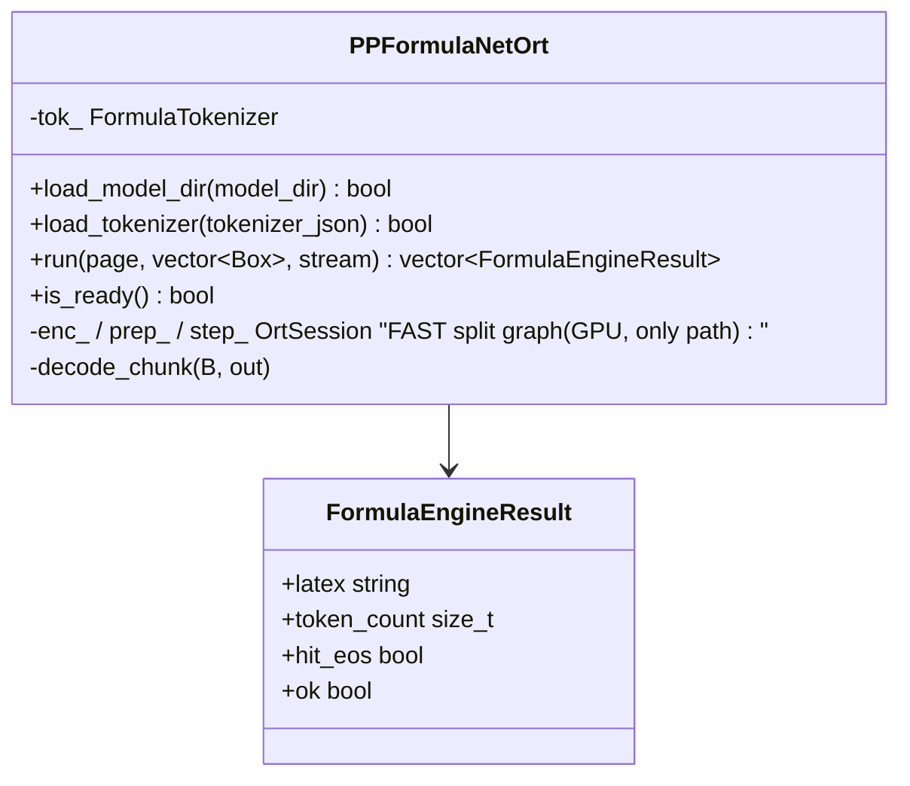

# Formula — `PP-FormulaNet-S` (in-process ORT-CUDA-13)

_Why the formula stage is a pure in-process C++ ONNX-Runtime decoder running a split-graph host loop — the only GPU path._

!!! abstract "TL;DR"

    - The live backend is **PP-FormulaNet-S** (`FORMULA_BACKEND=ppformulanet_s`),
      implemented by `PPFormulaNetOrt` (`src/formula/ppformulanet_ort.cu`).
    - It runs **entirely in-process on ONNX Runtime CUDA-13** — no Python, no
      sidecar process, no TensorRT engine for the formula stage.
    - **GPU: the FAST split graph is the only path** — `encoder.onnx` → `prep.onnx`
      (cross-attention KV prep) → `step_batched.onnx`, driven by a host-side
      static-KV autoregressive loop on the pipeline's CUDA stream. It matches the
      fused reference exactly at **CDM ≈ 0.811**, ~8× faster than the fused graph.
      The `fast/` split graphs are **required**: if any is missing the server
      fatal-aborts at boot — there is **no fused fallback**.
    - The fused graph (`inference_trt.onnx`) is used **only by the CPU-only build**
      (`CpuFormulaRecognizer`, ORT `CPUExecutionProvider`), where the CUDA host
      loop can't run. The GPU recognizer has no fused/EXACT mode.

## Backend selection

`FORMULA_BACKEND=ppformulanet_s` resolves through `make_formula_recognizer`
(`src/formula/formula_recognizer.cpp`) to `PPFormulaNetOrt`. A *configured*
formula backend that fails to load **aborts boot** (`maybe_load_router_models`)
— the server never starts with formulas silently disabled. A dispatched formula
region that yields no LaTeX is surfaced as `formula_degraded` in the response, so
a degraded stage never looks identical to a page that genuinely had no formula.

| Env | Meaning |
| --- | --- |
| `FORMULA_BACKEND=ppformulanet_s` | Select the local PP-FormulaNet-S backend. **This is all you need** — the baked weights at `models/formula/ppformulanet_s/` auto-resolve. |
| `FORMULA_ONNX=…/ppformulanet_s/` | **Override only** — point at a non-baked model root (the GPU loads its `fast/` split graphs from it). Not needed with the baked image. |
| `FORMULA_TOKENIZER=…/ppformulanet_s/tokenizer.json` | **Override only** — non-baked tokenizer path. |
| `PPFNS_CHUNK` | Decode batch size (default 8; clamped to [1, 32]) |
| `PPFNS_DROP_COLLAPSE=1` | Drop mode-collapsed runaway decodes to empty (opt-in; measured worse overall) |

### Swapping the local model: `-S` (fast) ⇄ `plus-M` (Chinese)

Two local in-process C++ formula models are selectable via `FORMULA_BACKEND`
(weights auto-resolve from `models/formula/<engine>/`; the `FORMULA_ONNX`/
`FORMULA_TOKENIZER` overrides below are optional, for non-baked locations):

| `FORMULA_BACKEND` | Model | Chinese (CJK-F1) | English | Speed¹ |
| --- | --- | --- | --- | --- |
| `ppformulanet_s` *(default)* | PP-FormulaNet-S (2-layer, MTP) | ✗ **0.00** | edit-sim 0.79 · CDM-F1 0.808 | **160 crops/s** |
| `ppformulanet_plus_m` | PP-FormulaNet_plus-M (6-layer MBart) | ✓ **0.73** | edit-sim 0.82 · CDM-F1 0.994 | 12.7 crops/s |

¹ Lockstep batch-30 on the 30-crop gate set (15 EN + 15 ZH), RTX 5090. CJK-F1 + edit-sim
measured this run via the in-process C++ decode (`tools/plusm_selftest.cpp`,
`PPFNS_GATE_BENCH`); CDM-F1 from the reference scorer. **`-S` is ~12.5× faster but reads
zero Chinese; `plus-M` recovers ~73% of Chinese characters and edges out `-S` on English,
at ~1/12 the throughput.** Use `-S` by default, swap to `plus-M` for Chinese documents.

```bash
# Chinese-capable (GPU only) — weights auto-resolve from the baked dir:
FORMULA_BACKEND=ppformulanet_plus_m
```

`plus-M` uses the **same in-process FAST host-loop design** as `-S` (its own
`encoder.onnx` + `prep.onnx` + static-KV `decoder_step.onnx`, single greedy token per
step, device-resident KV — no Python, no sidecar), decoder-verified bit-exact to the
reference greedy decode (29/30 gate crops token-identical, the 30th a single near-tie
flip). It is **6-layer / 512-d** vs `-S`'s 2-layer / 384-d, so per-step cost is higher;
treat it as the accuracy/Chinese option, `-S` as the throughput default.

## The execution path

On GPU, `PPFormulaNetOrt::load_model_dir` runs exactly one path — the FAST split
graph (`src/formula/ppformulanet_ort.cu`). There is no fused/EXACT mode and no
`FORMULA_DEVICE=cpu` here; the fused graph is reached only by the separate
CPU-only build (`CpuFormulaRecognizer`).

### FAST split graph (the only GPU path)

The Paddle export fuses the K=3 MTP decoder into a single `while`/`Loop` graph.
Running that fused loop per crop is correct but slow. The FAST path instead
splits it into three ONNX graphs and drives the autoregressive loop from C++:

| File (`…/ppformulanet_s/fast/`) | Role |
| --- | --- |
| `encoder.onnx` | image encoder → cross-attention memory (`{1, CTX, 2048}`); **bit-exact to the fused in-graph encoder** |
| `prep.onnx` | precomputes the cross-attention K/V (`ck`, `cv`) from the memory once per crop |
| `step_batched.onnx` | one autoregressive step over a **static** self-attention KV buffer |

All three run on the pipeline's CUDA stream via ORT-CUDA-13. The host loop keeps
a static KV buffer (`MAXLEN = 1056`, i.e. `MAXIT = 342` steps × 3 MTP slots =
1026 tokens — sized to the model's 1029-long positional embedding) and an
on-device argmax kernel; it syncs only every `CHECK` steps to test for EOS. This
matches the fused reference's output while amortizing the loop overhead.

!!! warning "The `fast/` artifacts"

    The three `fast/` ONNX graphs ship as **release assets**
    (`ppformulanet_s_fast_{encoder,prep,step_batched}.onnx`), and
    `scripts/fetch_release_models.sh` downloads them to
    `formula/ppformulanet_s/fast/` — nothing has to be generated to run the
    shipped model. (An earlier revision of this section pointed at a
    pre-release scratch script that was never published.) The `fast/` graphs
    are **required** on GPU: if any is
    missing or fails to load, `load_model_dir` prints a `FATAL` and **aborts boot**
    — there is **no fused fallback**. The fast bundle must ship with the model.

### Fused graph (CPU-only build)

The fused `inference_trt.onnx` is loaded only by `CpuFormulaRecognizer`
(`src/formula/cpu_formula_recognizer.cpp`) on ORT `CPUExecutionProvider`, used by
the CPU-only server where the CUDA host loop can't run. It is **not** reachable
from the GPU recognizer (no `PPFNS_EXACT`, no `FORMULA_DEVICE`).

## Decode

Crops are preprocessed (`formula_preprocess_one`, `ppformulanet_preprocess.cpp`)
to a fixed `S×S` grayscale, ImageNet-normalised canvas, batched `PPFNS_CHUNK` at
a time. The decoder emits MTP token triples; the host loop stops a crop at the
first `EOS` and strips BOS (id 0) / pad (id 1). `FormulaTokenizer`
(`src/formula/formula_tokenizer.cpp`) — a BPE over the `tokenizer.json` vocab —
decodes the surviving token ids to LaTeX (`VOCAB = 50000`).

`FormulaEngineResult` carries `latex`, `token_count`, `hit_eos`, and the `ok`
status channel (false on a backend error, distinct from a clean empty result).

## C++ surface



## Where it plugs in

`OcrPipeline::dispatch_router_` (`src/pipeline/ocr_pipeline_run.cpp`) collects the
formula layout regions, waits on `det_only_event_` so the page image is safe to
read, and calls `PPFormulaNetOrt::run` on `formula_stream_`. The local backend is
synchronous (`supports_async()==false`); only the external VLM backend defers via
`finalize_deferred`.

!!! info "See also"

    - [Table](table.md) — the table stage and its SLANeXt / VLM backends.
    - [Router](../architecture/router.md) — which layout class IDs route into formulas.
    - [Model Interactions](interactions.md) — formula step in the full-pipeline sequence.
    - [Speed vs accuracy](../resources_speed_accuracy.md) — measured formula CDM across configs.
