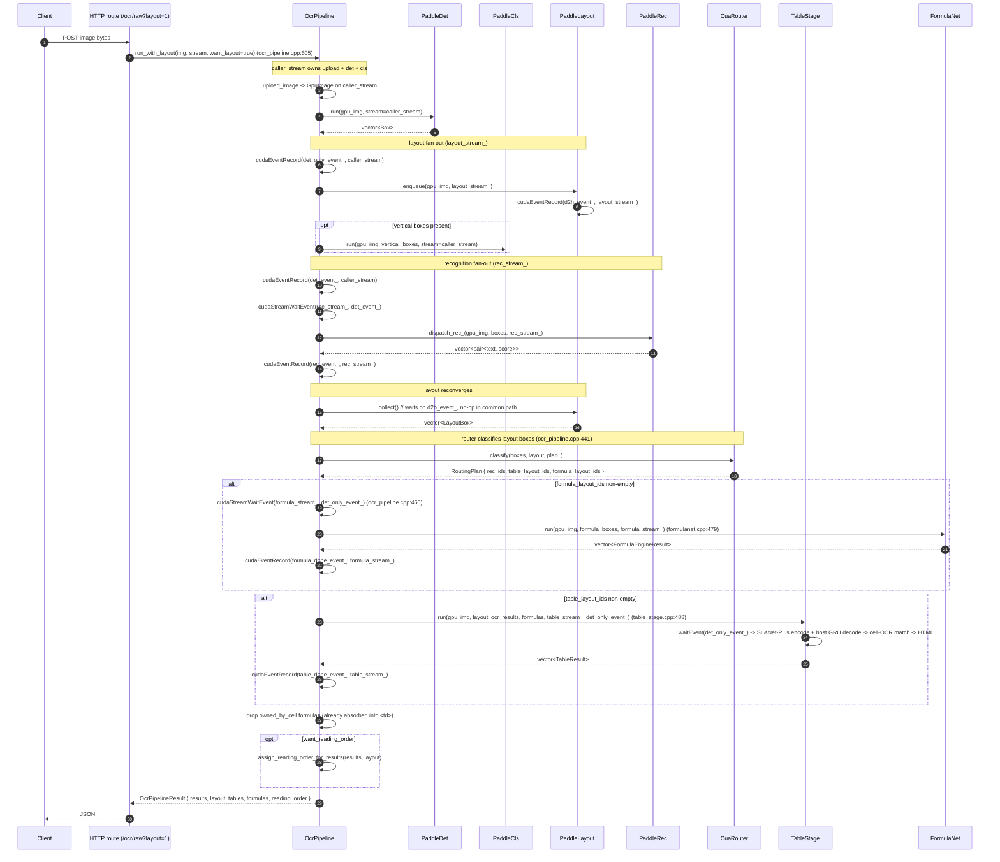
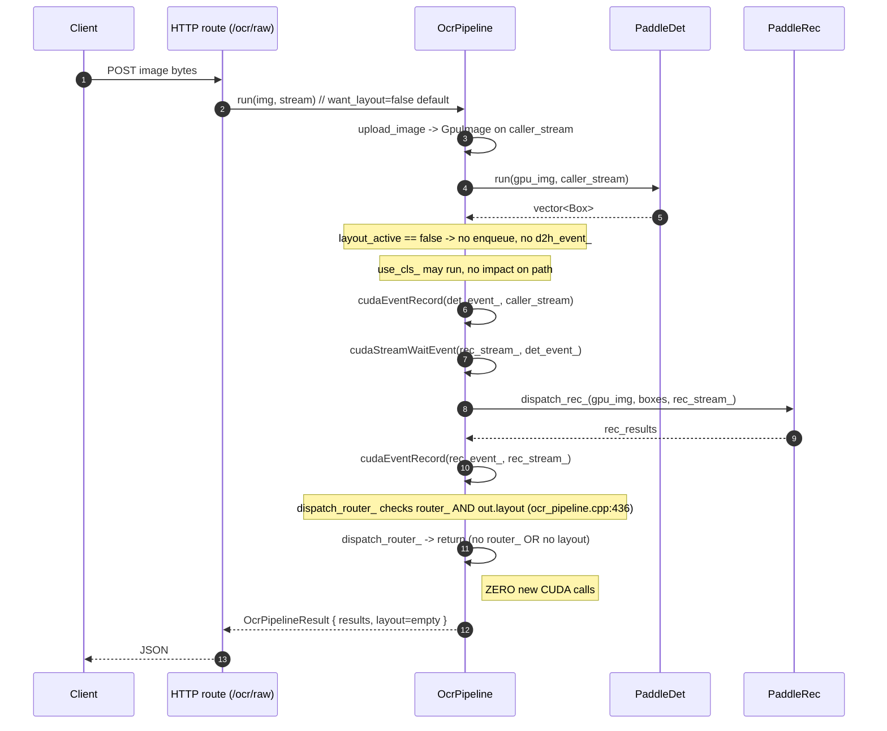

# Model Interactions — End-to-End Lifecycle

!!! note "Line anchors are historic"
    The `ocr_pipeline.cpp:NNN` anchors on this page refer to the pre-merge
    GPU pipeline, retired in the 2026-07 unified-backend merge. The logic
    they describe lives on in `src/pipeline/unified/unified_ocr_pipeline.cpp`
    and the router sources; the design described here is current, the line
    numbers are not.

_How seven C++ classes coordinate one upload into one JSON response across four CUDA streams._

!!! abstract "TL;DR"

    - **Happy path with layout** — det → cls → layout fan-out, rec on `rec_stream_`, then router + formula + table reconverge into one `OcrPipelineResult`.
    - **Text-only short-circuit** — three guards in `dispatch_router_` bail before any new CUDA call when the router or layout output is missing. This is the 6–7 ms p50 invariant (internal engineering notes sweeps 1–8).
    - Formulas run **before** tables so `<td>`-absorbed formulas can be flagged `owned_by_cell` and dropped from the top-level array.

Seven C++ classes turn a `/ocr/raw` upload into a JSON response: `PaddleDet`,
`PaddleCls`, `PaddleLayout`, `PaddleRec`, `CuaRouter`, `TableStage`, and
`FormulaNet`. This page traces *how they talk to each other*, including which
CUDA stream each call lands on. For per-class behaviour, see the individual
model pages. For the stream/event mechanics in detail, see
[Architecture · CUDA Streams](../architecture/cuda-streams.md).

## Happy path — full pipeline



Call sites in source:
[`OcrPipeline::run_with_layout`](https://github.com/aiptimizer/TurboOCR/blob/main/src/pipeline/unified/unified_ocr_pipeline.cpp) at line
605, [`dispatch_router_`](https://github.com/aiptimizer/TurboOCR/blob/main/src/pipeline/unified/unified_ocr_pipeline.cpp) at line 430,
[`dispatch_rec_`](https://github.com/aiptimizer/TurboOCR/blob/main/src/pipeline/unified/unified_ocr_pipeline.cpp) at line 517,
[`TableStage::run`](https://github.com/aiptimizer/TurboOCR/blob/main/src/models/table/table_stage.cpp) at line 488, and
[`FormulaNet::run`](https://github.com/aiptimizer/TurboOCR/blob/main/src/models/formula/formulanet.cpp) at line 479.

## Text-only short-circuit — preserving the 6 ms p50



The three guards that make this bit-identical to the no-router pipeline are at
[`ocr_pipeline.cpp:436-453`](https://github.com/aiptimizer/TurboOCR/blob/main/src/pipeline/unified/unified_ocr_pipeline.cpp):

1. `if (!router_) return;` — router not loaded.
2. `if (out.layout.empty()) return;` — layout disabled per call.
3. `if (!has_table && !has_formula) return;` — layout had no table/formula
   classes after `CuaRouter::classify`.

Each guard bails **before** any new `cudaStreamWaitEvent` /
`cudaEventRecord` / TRT execute. Plan 04 §7 names this the "zero new CUDA
calls" invariant.

## Data dependency DAG

The streams overlap, but the *data* dependencies are strict. Each downstream
node consumes only what is shown by an arrow into it.

```mermaid
flowchart TD
  IMG[GpuImage<br/>upload_image] --> DET[PaddleDet.run<br/>caller_stream]
  IMG --> LAY[PaddleLayout.enqueue<br/>layout_stream_]
  DET -->|boxes| CLS[PaddleCls.run<br/>caller_stream<br/>vertical only]
  CLS -->|boxes mut| REC[PaddleRec.run<br/>rec_stream_]
  DET -->|boxes| REC

  LAY -->|LayoutBox[]| RTR[CuaRouter.classify<br/>CPU]
  DET -->|boxes| RTR
  RTR -->|table_layout_ids| TBL[TableStage.run<br/>table_stream_]
  RTR -->|formula_layout_ids| FRM[FormulaNet.run<br/>formula_stream_]

  IMG --> TBL
  IMG --> FRM
  REC -->|OCRResultItem[]| TBL
  FRM -->|FormulaResult[]| TBL

  REC --> OUT
  LAY --> OUT
  FRM --> OUT
  TBL --> OUT[OcrPipelineResult]
```

Key observations:

- `REC` blocks on `det_event_` (det+cls finished) but not on `LAY`.
- `LAY` blocks on `det_only_event_` (det finished, before cls) so it overlaps
  with cls and rec.
- `TBL` blocks on `det_only_event_` AND on `REC` (it needs `ocr_lines` for
  cell↔OCR matching). The event ordering is enforced inside `TableStage::run`
  ([`table_stage.cpp:513-514`](https://github.com/aiptimizer/TurboOCR/blob/main/src/models/table/table_stage.cpp)); the data
  dependency on `REC` is enforced by `OcrPipeline::dispatch_router_` running
  it *after* `dispatch_rec_` finishes
  ([`ocr_pipeline.cpp:687, 724`](https://github.com/aiptimizer/TurboOCR/blob/main/src/pipeline/unified/unified_ocr_pipeline.cpp)).
- `FRM` blocks on `det_only_event_` only. It runs before `TBL` so absorbed
  formulas can be flagged `owned_by_cell` and dropped from the top-level array.

## How a result is assembled

`OcrPipelineResult` is just an aggregate of `vector` fields:

```cpp
struct OcrPipelineResult {
  std::vector<OCRResultItem>             results;       // (text, score, box)
  std::vector<layout::LayoutBox>         layout;        // empty if no layout
  std::vector<router::TableResult>       tables;        // empty if no tables
  std::vector<router::FormulaResult>     formulas;      // post owned_by_cell drop
  std::vector<int>                       reading_order; // empty if not requested
};
```

The HTTP route serialises this struct directly (see [HTTP API](../reference/http.md)).
gRPC mirrors the same field set in `proto/ocr.proto`. None of the
downstream consumers needs to know which CUDA stream produced which field —
the `OcrPipeline` is the merge point.

!!! info "See also"

    - [CUDA Streams](../architecture/cuda-streams.md) — full event/stream mechanics for the four GPU streams referenced above.
    - [Router](../architecture/router.md) — how `CuaRouter::classify` decides what goes to `TableStage` vs `FormulaNet` vs `PaddleRec`.
    - [Table](table.md) — what happens inside `TableStage::run`, including formula absorption.
    - [Formula](formula.md) — the host-side AR loop driving `FormulaNet::run`.
