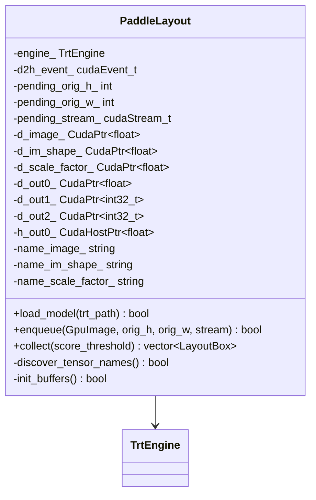
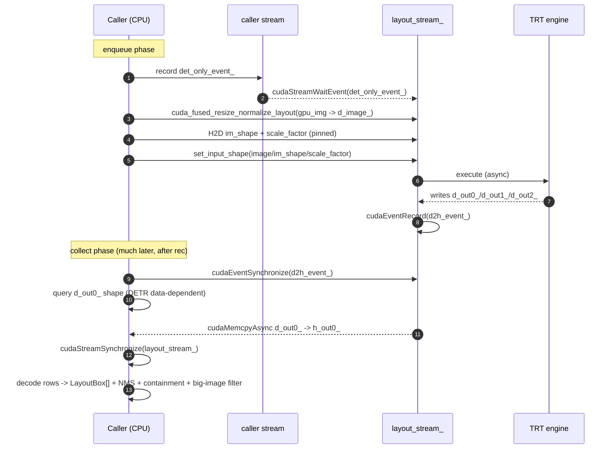

# Layout — `PaddleLayout`

PP-DocLayoutV3 (RT-DETR-L variant) at fixed `800×800` input. Returns per-region
classes and bounding boxes: text, title, table, figure, formula, list, header,
footer, etc. This is what makes the *router* possible — without layout, the
pipeline has no way to know which boxes go to the recognizer, which go to the
table backend, and which go to the formula backend.

## Why this design — the split `enqueue` / `collect`

PP-DocLayoutV3 is a DETR-family model with **data-dependent output shape**:
the count of valid detections is only known after execute completes. A naïve
implementation would call `getTensorShape()` mid-pipeline, which on TRT 10.x
forces an implicit GPU sync that stalls the worker thread and kills the
overlap with `PaddleRec`.

The header comment on `PaddleLayout`
([`src/backends/nvidia/stages/paddle_layout.h:14-31`](https://github.com/aiptimizer/TurboOCR/blob/main/src/backends/nvidia/stages/paddle_layout.h))
spells out the contract:

> Usage is split into two phases so the CPU doesn't have to block in the
> middle of `OcrPipeline::run()`:
>
> 1. `enqueue(...)` — async preprocess + H2D + TRT execute + D2H, plus an
>    event record at the tail of the D2H.
> 2. `collect(...)` — blocks on that event, then CPU-decodes the
>    `(N, 7)` detection rows.

Because rec on `rec_stream_` already drains the layout stream's event by the
time `collect()` runs, the wait is a no-op in the common path — layout adds
zero wall-clock to the text-only invariant.

## Model card

| Field | Value |
| --- | --- |
| ONNX path | `models/layout/layout.onnx` (PP-DocLayoutV3, RT-DETR-L) |
| Engine cache key | `layout_<gpu>_<trt_version>.plan` |
| Inputs | `image : (1, 3, 800, 800)` float32 · `im_shape : (1, 2)` float32 · `scale_factor : (1, 2)` float32 |
| Dynamic profile | batch 1/1/8 (only batch 1 used in v1) |
| Outputs | `(-1, 7)` detection tensor `[class_id, score, xmin, ymin, xmax, ymax, read_order]` · `(B,)` count · `(N, 200, 200)` mask (allocated and ignored — TRT requires an address) |
| Precision | FP16 |
| Max queries | `kMaxDetections = 300` ([`paddle_layout.h:60`](https://github.com/aiptimizer/TurboOCR/blob/main/src/backends/nvidia/stages/paddle_layout.h)) |
| Score threshold | caller-supplied; default `0.3` ([`paddle_layout.h:55`](https://github.com/aiptimizer/TurboOCR/blob/main/src/backends/nvidia/stages/paddle_layout.h)) |
| Post-decode NMS | same-class IoU `0.6`, cross-class IoU `0.98`, containment-drop ≥ 0.8 ([`paddle_layout.cpp:254-296`](https://github.com/aiptimizer/TurboOCR/blob/main/src/models/layout/paddle_layout.cpp)) |
| Large-image filter | drops class 14 ("image") covering >82% of portrait pages, >93% of landscape ([`paddle_layout.cpp:299-307`](https://github.com/aiptimizer/TurboOCR/blob/main/src/models/layout/paddle_layout.cpp)) |

The unused `(N, 200, 200)` mask tensor still has to own a device buffer
(`d_out2_`) — TRT requires a valid address for every output. The comment at
[`paddle_layout.h:83-87`](https://github.com/aiptimizer/TurboOCR/blob/main/src/backends/nvidia/stages/paddle_layout.h) calls
this out explicitly.

## Class taxonomy

`class_id` indexes the 25-class PP-DocLayoutV3 label list, defined as
`kLayoutLabels` in
[`layout_types.h:19-27`](https://github.com/aiptimizer/TurboOCR/blob/main/include/turbo_ocr/core/layout_types.h).
Order matches `PP-DocLayoutV3/inference.yml` `label_list`, so the index is the
model's raw class output:

| ID | Label | ID | Label | ID | Label |
| --- | --- | --- | --- | --- | --- |
| 0 | `abstract` | 9 | `footer_image` | 18 | `reference` |
| 1 | `algorithm` | 10 | `footnote` | 19 | `reference_content` |
| 2 | `aside_text` | 11 | `formula_number` | 20 | `seal` |
| 3 | `chart` | 12 | `header` | 21 | `table` |
| 4 | `content` | 13 | `header_image` | 22 | `text` |
| 5 | `display_formula` | 14 | `image` | 23 | `vertical_text` |
| 6 | `doc_title` | 15 | `inline_formula` | 24 | `vision_footnote` |
| 7 | `figure_title` | 16 | `number` | | |
| 8 | `footer` | 17 | `paragraph_title` | | |

Synthetic regions (an OCR result that landed inside no detected box) get the
sentinel `class_id = -1` / label `SupplementaryRegion`
([`layout_types.h:34-36`](https://github.com/aiptimizer/TurboOCR/blob/main/include/turbo_ocr/core/layout_types.h)),
mirroring PaddleX's fallback so every result still points into the layout array.

## Region hierarchy — `parent_id`

The layout model emits genuine children, not just overlapping duplicates: a
`figure_title` inside a `chart`/`image`, a `formula_number` inside a
`display_formula`, a `paragraph_title` inside a `content` block. Every region
carries the `id` of the region containing it as `parent_id`, so clients get the
nesting instead of a flat list. The field is omitted for top-level regions.

The parent is the **smallest** region that contains a box (same ≥ 90%-of-area
rule the merge modes use, `layout_box_inside` — one predicate, so the hierarchy
and the drop rule cannot disagree), which makes a caption inside a figure inside
a content block point at the figure. Two guarantees hold in every merge mode:

* **No cycles.** A parent must outrank its child in the total order
  (area descending, index ascending), so parent links strictly ascend a finite
  order. Two near-duplicate boxes each ≥ 90% inside the other — which NMS only
  suppresses at IoU ≥ 0.98 across classes — resolve to "larger is the parent";
  the larger one gets `parent_id: -1` rather than pointing back down.
* **No dangling ids.** Under `outer`/`inner` a survivor whose parent was dropped
  inherits the nearest surviving ancestor, or `-1` if the whole chain went.

Note that whether two regions nest is the model's call, not a threshold: on
ordinary pages PP-DocLayoutV3 tightly crops the `image` box to the picture and
emits the caption as a separate region *below* it, and puts `formula_number` in
the right margin *beside* the equation. Those are disjoint boxes — siblings,
with no containment to record.

## Nested-box reconciliation — `LAYOUT_MERGE_MODE`

The shared post-decode cleanup
([`layout_postfilter.h:38-129`](https://github.com/aiptimizer/TurboOCR/blob/main/include/turbo_ocr/models/layout/layout_postfilter.h))
runs NMS, the oversized-`image` drop, then reconciles nested boxes according to
the `LAYOUT_MERGE_MODE` env var (default `all`). A box A is "inside" B when
≥ 90% of A's area overlaps B.

| Mode | Behavior |
| --- | --- |
| `all` (default) | Keep all boxes; no nested-box reconciliation. |
| `outer` | Keep outer regions; drop boxes nested inside them. |
| `inner` | Keep the innermost boxes; drop the pure containers. |

The old names `union`/`large`/`small` are still accepted as deprecated aliases
of `all`/`outer`/`inner`.

**`LAYOUT_KEEP_NESTED_CHILDREN`** (default `0`) refines the `outer`/`inner` modes:
when set to `1`, the model's legitimate child regions (`figure_title`, `footnote`,
`formula_number`, `paragraph_title`) are kept even when nested in a parent, instead
of being dropped. Formula regions are always kept. It has no effect under the
default `all` (which already keeps everything).

The default `all` keeps every box the model emitted — formulas, tables, titles
and footnotes that the layout model intentionally nests inside a larger region
all survive (assembly de-dupes), so nothing is silently dropped.

The same page under each mode — `outer` collapses the form to its outer
containers, `inner`/`all` keep the inner field boxes:

`outer` suits document parsing where only the outer region matters, but it
collapses **forms**: every field is a box inside an outer frame, so the nested
field boxes get dropped and the page reduces to a handful of containers. Keep
the default `all` (or use `inner`) for forms.

`display_formula` (5) and `inline_formula` (15) are never counted as nested
inside a non-formula box
([`layout_postfilter.h:30-34`](https://github.com/aiptimizer/TurboOCR/blob/main/include/turbo_ocr/models/layout/layout_postfilter.h)),
so standalone math is never swallowed by a surrounding text or table region.

## Latency budget

Per-page layout cost is **hidden under rec** because `layout_stream_` is
independent. Total wall-clock is bounded by `max(layout, cls + rec)`; on
typical pages rec dominates so the `cudaEventSynchronize(d2h_event_)` inside
`collect()` ([`paddle_layout.cpp:166`](https://github.com/aiptimizer/TurboOCR/blob/main/src/models/layout/paddle_layout.cpp)) is
a no-op. The bench diary's text-only 6–7 ms p50 figure includes layout runs.

## C++ surface

Input/output tensor names are discovered from the engine's binding metadata at
load time because `paddle2onnx` does not guarantee declaration order
([`paddle_layout.cpp:19-68`](https://github.com/aiptimizer/TurboOCR/blob/main/src/models/layout/paddle_layout.cpp)). The `(N, 7)`
detection tensor is identified by rank; the `(B,)` count tensor and `(N, 200,
200)` mask are matched by shape.

## Per-image flow

## Reading-order seed

Each row's column 6 (`read_order`) is the model's own reading-order index.
`OcrPipeline::run_with_layout` uses it indirectly: when `want_reading_order` is
set, `turbo_ocr::layout::assign_reading_order_for_results` re-derives an order
over the post-NMS regions plus synthetic XY-cut entries for results that did
not land inside any layout box
([`ocr_pipeline.cpp:730-734`](https://github.com/aiptimizer/TurboOCR/blob/main/src/pipeline/unified/unified_ocr_pipeline.cpp)).

### Strata

Before XY-cut runs, classes are partitioned into three strata so page furniture
lands in the right slot regardless of where the detector placed it. The
membership is `reading_priority_bucket` in
[`layout_types.h:66-85`](https://github.com/aiptimizer/TurboOCR/blob/main/include/turbo_ocr/core/layout_types.h):

| Stratum | Bucket | Classes |
| --- | --- | --- |
| **TOP** (read first) | 0 | `header` (12), `header_image` (13) |
| **BODY** (class-aware XY-cut) | 1 | every other class, including `number` (16) |
| **BOTTOM** (read last) | 2 | `footer` (8), `footer_image` (9), `footnote` (10), `reference` (18), `reference_content` (19), `vision_footnote` (24) |

`number` (page numbers) stays in BODY because it can sit at the top *or* the
bottom of a page — XY-cut places it by geometry. Within each bucket XY-cut
still applies, so multi-line headers, footers, and reference lists keep their
natural left-to-right / top-to-bottom order. The class IDs above are pinned
with `static_assert` against `kLayoutLabels`
([`layout_types.h:89-96`](https://github.com/aiptimizer/TurboOCR/blob/main/include/turbo_ocr/core/layout_types.h)),
so a future PaddleX label re-shuffle fails the build instead of silently
misrouting a class.

## Where it plugs in

The cls/rec subgraph runs on the caller stream / `rec_stream_`; layout runs on
`layout_stream_` with `det_only_event_` as its only upstream wait. `collect()`
fires at the tail of `run_with_layout` right before `dispatch_router_` consumes
the layout boxes to decide which regions go to the table backend
(`SlanextTableRecognizer`) and the formula backend (`PPFormulaNetOrt`).
See [Architecture · CUDA Streams](../architecture/cuda-streams.md) for the
event diagram.

!!! info "See also"
    - [Router](../architecture/router.md) — class IDs `0..24` and how they map to text / table / formula destinations.
    - [Table](table.md) — the destination for layout class 21.
    - [Formula](formula.md) — destinations for inline / display formula classes.
    - [CUDA Streams](../architecture/cuda-streams.md) — `layout_stream_` swimlane and the `det_only_event_` wait.
