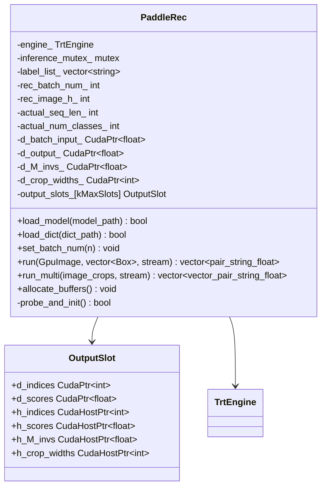
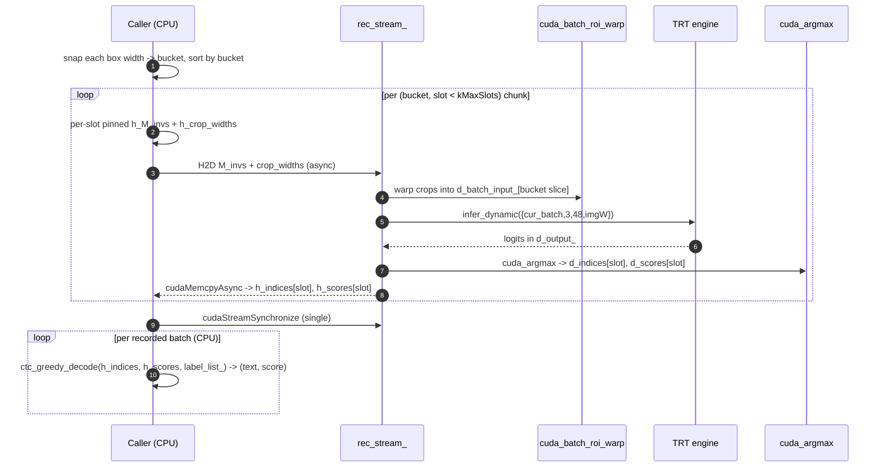

# Recognition — `PaddleRec`

CRNN encoder + greedy CTC decoder. Takes detection boxes plus the source
`GpuImage`, produces `(text, confidence)` per box. The text-only latency story
is dominated by this stage — every visual optimisation in the pipeline exists
to keep recognition fed without stalling.

## Why this design

Two design pressures shape `PaddleRec`:

1. **Crop widths vary wildly.** A page mixes lines of 80 px and 1600 px, and
   TRT engines hate per-call shape churn. The fix is **width-bucket batching**:
   crops snap to the nearest entry of
   `kWidthBuckets = {320, 480, 800, 1200, 1600, 2000, 2500, 3200, 4000}`
   ([`paddle_rec.h:58`](https://github.com/aiptimizer/TurboOCR/blob/main/include/turbo_ocr/models/recognition/paddle_rec.h)) and
   bucket-mates run as one TRT batch.

2. **Per-batch sync kills GPU utilisation.** A naïve loop is `H2D → execute →
   D2H → CTC decode → next batch`. With many batches per page (a 200-line page
   at batch 32 needs 7 batches), each `cudaStreamSynchronize` between batches
   leaves the GPU idle while the CPU CTC-decodes. The fix is the
   **multi-slot deferred-sync** loop
   ([`paddle_rec.cpp:122-244`](https://github.com/aiptimizer/TurboOCR/blob/main/src/models/recognition/paddle_rec.cpp)): up to
   `kMaxSlots = 20` ([`paddle_rec.h:76`](https://github.com/aiptimizer/TurboOCR/blob/main/include/turbo_ocr/models/recognition/paddle_rec.h))
   GPU work items queue back-to-back, each writing to its own output buffer.
   A single `cudaStreamSynchronize` at the end drains everything, then CPU CTC
   decode runs over all slots. Comment at
   [`paddle_rec.cpp:122-130`](https://github.com/aiptimizer/TurboOCR/blob/main/src/models/recognition/paddle_rec.cpp) calls out
   that this eliminates `~N-1 cudaEventSynchronize` calls and the GPU idle gaps
   they create.

Per-slot pinned-host transform buffers (`h_M_invs` / `h_crop_widths`) are
required to avoid a DMA race: slot N's CPU can prepare slot N+1's transforms
while slot N's H2D copy is still in flight
([`paddle_rec.h:80-84`](https://github.com/aiptimizer/TurboOCR/blob/main/include/turbo_ocr/models/recognition/paddle_rec.h)).

## Model card

| Field | Value |
| --- | --- |
| ONNX path | `models/rec{,_small,_tiny}.onnx` (PP-OCRv6 medium/small/tiny, Latin+Chinese+Japanese; default tier `tiny`) plus per-script under `models/rec/{arabic,korean,greek,eslav,thai}/rec.onnx` (retained PP-OCRv5) |
| Engine cache key | `rec_<gpu>_<trt_version>.plan` (one per script) |
| Input tensor | `x : (N, 3, 48, W)` float32, BGR, ImageNet-normalised |
| Dynamic profile | MIN `(1,3,48,32)` · OPT `(32,3,48,320)` · MAX `(32,3,48,4000)` |
| Output tensor | `(N, seq_len, num_classes)` float32 logits (probed at load via `probe_output_dims`) — buffers reserve `seq_len=600`, `num_classes=20000` (`paddle_rec.h:61-62`) |
| Precision | FP16 |
| Batch | `rec_batch_num_ = 32` ([`paddle_rec.h:51`](https://github.com/aiptimizer/TurboOCR/blob/main/include/turbo_ocr/models/recognition/paddle_rec.h)), configurable via `set_batch_num` |
| Image height | `rec_image_h_ = 48 px` |
| Width clamp | `kMaxRecWidth = 4000`, snapped to `kWidthBuckets` |
| Min width | 32 px (not forced to 320 as in older Paddle) |
| Slot pool | `kMaxSlots = 20` — enough for 640 boxes at batch 32 |

A shared-pool mutex (`inference_mutex_`,
[`paddle_rec.h:91-95`](https://github.com/aiptimizer/TurboOCR/blob/main/include/turbo_ocr/models/recognition/paddle_rec.h))
serialises `run()`/`run_multi()` across worker threads when one `PaddleRec` is
shared via `std::shared_ptr` by multiple `OcrPipeline` replicas in a pool. The
mutex is taken at the top of `run()` ([`paddle_rec.cpp:92`](https://github.com/aiptimizer/TurboOCR/blob/main/src/models/recognition/paddle_rec.cpp)).

## Multilingual fan-out

`OcrPipeline::dispatch_rec_` classifies each box with `ScriptIdEngine`,
clamps confidences `< 0.6` to the first loaded language, groups boxes by
script, fans out to the per-script `PaddleRec`, and merges results back in
input order. With only the Latin engine loaded and no script classifier, the
dispatcher short-circuits to the Latin engine's `run()` — bit-identical to the
single-engine path ([`ocr_pipeline.cpp:521-538`](https://github.com/aiptimizer/TurboOCR/blob/main/src/pipeline/unified/unified_ocr_pipeline.cpp)
and the surrounding `dispatch_rec_`).

`run_multi(...)` ([`paddle_rec.cpp:246-432`](https://github.com/aiptimizer/TurboOCR/blob/main/src/models/recognition/paddle_rec.cpp))
is the batch-of-images variant used by `/ocr/batch`: it flattens
`(img_idx, box_idx)` tuples, sorts by `(bucket, img_idx)` so same-width crops
from the same image stay contiguous, and reuses the same multi-slot loop.

## Latency budget

Aggregate text-only **p50 5.9–7.0 ms** on RTX 5090 across the bench-diary
sweeps. Recognition is the bottleneck of that figure; det/cls/layout overlap
behind it on their own streams. Per-bucket TRT execute cost on a 5090
(measured during sweep 8) is roughly:

| Bucket width | per-batch (32) cost |
| ---: | ---: |
| 320 | ≈0.6 ms |
| 800 | ≈1.4 ms |
| 1600 | ≈2.6 ms |
| 3200 | ≈5.1 ms |

These are nominal; the multi-slot loop hides them behind the H2D and CTC-decode
pipelines.

## C++ surface

## Per-image flow

`ctc_greedy_decode` lives in `include/turbo_ocr/analysis/recognition/ctc_decode.h` and runs purely on
the CPU after the deferred sync; it is a tight argmax-over-time loop that
collapses repeats and strips the blank class.

## Where it plugs in

Called from `OcrPipeline::dispatch_rec_`
([`ocr_pipeline.cpp:517-…`](https://github.com/aiptimizer/TurboOCR/blob/main/src/pipeline/unified/unified_ocr_pipeline.cpp)) on
`rec_stream_`. Recognition's only upstream wait is `det_event_`, recorded after
det+cls finish on the caller stream
([`ocr_pipeline.cpp:684-687`](https://github.com/aiptimizer/TurboOCR/blob/main/src/pipeline/unified/unified_ocr_pipeline.cpp)). When rec
completes, `rec_event_` is recorded so the **next** call's upload waits on it
before overwriting the GPU image buffer — see
[CUDA Streams](../architecture/cuda-streams.md).

!!! info "See also"
    - [Detection](detection.md) and [Classification](classification.md) — the two stages whose output rec consumes.
    - [CUDA Streams](../architecture/cuda-streams.md) — `rec_stream_` swimlane, `det_event_` / `rec_event_` records.
    - [Model Interactions](interactions.md) — the full per-page life cycle with rec in context.
