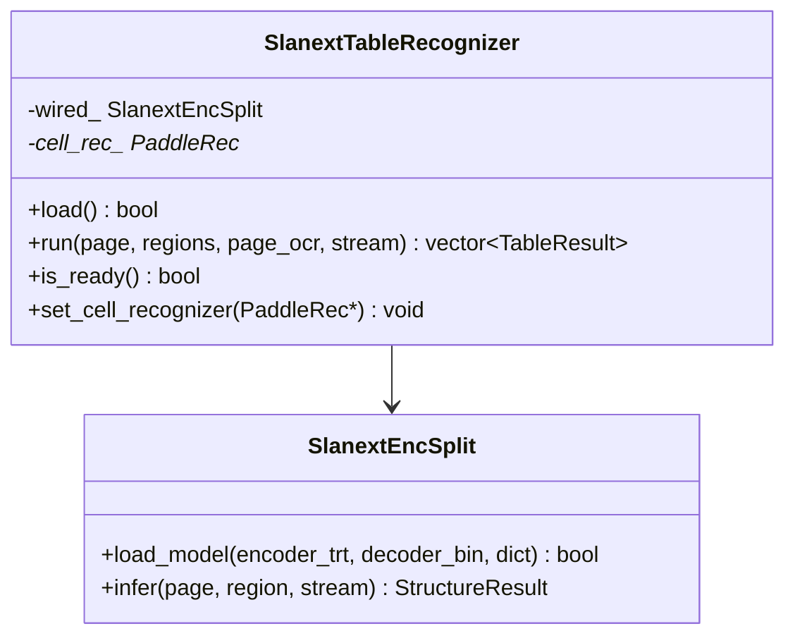

# Table — `SlanextTableRecognizer` + `SlanextEncSplit`

_How the pipeline turns a layout-class-21 region into HTML — split encoder/host decoder and OCR-cell matching on `table_stream_`._

!!! warning "Model identity — it's SLANet-Plus, not the SLANeXt transformer"

    Despite the `SLANeXt_*` file names and `Slanext*` class names (a historical
    misnomer), the deployed structure model is **SLANet-Plus** — a PP-LCNet CNN
    backbone + a GRU-attention SLAHead. The shipped `SLANeXt_wired_encoder.onnx` +
    `_decoder.bin` are **byte-identical** to `models/table/slanet_plus.onnx`
    (verified by value: 379/379 encoder weights + all 16 decoder tensors match).

    We do **not** run that ONNX end-to-end. We run a **custom split** of those
    SLANet-Plus weights — a **TRT FP16 CNN encoder** producing the `[1,256,96]`
    feature, feeding a **hand-written C++ GRU+attention decoder** (see *Why the
    design* below). Same weights, same math, same accuracy as SLANet-Plus, but
    ~3.6× faster than the ONNX and fully in-process — that custom runtime is the
    whole point.

    The **wired/wireless router is inert and has been removed.** The shipped
    "wireless" encoder was a byte-identical **duplicate** of the wired one, and the
    genuine PaddleX SLANeXt (a 512×512 transformer) measured **worse** on borderless
    tables (−0.04 to −0.07 struct-TEDS on OmniDocBench), so there is no real
    wired/wireless distinction to exploit. A single SLANet-Plus encoder is used. For
    borderless-heavy documents the lever is the **VLM table backend**, not a second
    structure encoder.

!!! abstract "TL;DR"

    - Table recognition is **opt-in** behind one `ITableRecognizer`, selected by
      `TABLE_BACKEND` (`slanext` = local, the default ML backend · `vlm` =
      external). It loads only when configured and the model files are present.
    - `SlanextEncSplit` is the local structure model (SLANet-Plus weights): a **TRT FP16 CNN encoder**
      (488×488 letterbox → feature `[1, 256, 96]`) feeding a **host-side
      GRU+attention decoder** that emits HTML structure tokens (vocab 50, ≤ 501
      tokens) + a 4-corner quad per `<td>`.
    - A CUDA-free sibling `OrtSlanextTableRecognizer` (wrapped by `CpuTableRecognizer`) runs the same split with an ORT-CPU
      encoder for the CPU build.
    - The backend matches each cell quad to the page OCR and reconstructs HTML;
      empty cells are back-filled with per-cell crop OCR.
    - All GPU work runs on `table_stream_` gated by `det_only_event_`, so
      text-only pages pay zero new CUDA calls.

## Why the design — split encoder / host decoder

The fused SLANeXt ONNX (CNN encoder + autoregressive GRU-attention decoder)
**cannot build under TensorRT**: the decoder `Loop` trips
`makeScopeNodesContiguous`. So `SlanextEncSplit`
([`src/backends/nvidia/stages/slanext_enc_split.h`](https://github.com/aiptimizer/TurboOCR/blob/main/src/backends/nvidia/stages/slanext_enc_split.h))
splits it — the CNN encoder runs on a TRT FP16 engine producing the feature
`[1, T_enc=256, C=96]`, and the small GRU+attention+2-head decoder runs on the
host (CPU) one token at a time. Per-step compute is tiny (256-hidden GRU,
96-dim attention over 256 positions, a 50-token structure classifier, and an
8-coord bbox head), so the host loop is fast and avoids the unbuildable `Loop`
entirely. The host decode is numpy-parity-verified at 100% token match vs the
full ONNX.

The split shape constants are pinned on `SlanextEncSplit`: `kInputSize = 488`,
`kTenc = 256`, `kCtx = 96`, `kHidden = 256`, `kVocab = 50`, `kLoc = 8`,
`kMaxTokens = 501` (the host walk early-terminates at the first `<eos>`).

A **single** SLANet-Plus encoder serves every table region — the former
wired/wireless `TableCls` router has been removed (see the *Model identity*
admonition above)
([`src/backends/nvidia/stages/slanext_table_recognizer.cpp`](https://github.com/aiptimizer/TurboOCR/blob/main/src/backends/nvidia/stages/slanext_table_recognizer.cpp)).

## Backend selection

`make_table_recognizer`
([`src/backends/nvidia/stages/table_recognizer.cpp`](https://github.com/aiptimizer/TurboOCR/blob/main/src/backends/nvidia/stages/table_recognizer.cpp))
resolves `TABLE_BACKEND`:

| Backend | Class | Notes |
| --- | --- | --- |
| `slanext` | `SlanextTableRecognizer` | Local TRT-encoder + host-decoder (default ML backend). |
| `vlm` | `VLMTableRecognizer` | External OpenAI-compatible VLM on region crops; async. |
| *(unset)* | — | Table routes to the geometric line-art fallback; no ML model loaded. |

The router activates an ML table backend only when one is actually configured —
either `TABLE_BACKEND` is set explicitly, or `TABLE_SLANEXT_ENCODER_ONNX` /
`VLLM_TABLE_BASE_URL` is present (the env-synthesised default). A backend that is
configured but fails to load **aborts boot** (`load_table_into_registry`,
`recognizer_registry.cpp`) — the server never starts with tables silently
disabled. A dispatched region that decodes to empty HTML is surfaced as
`table_degraded` (with a `table_warning` count) in the response.

### Environment

| Env | Default | Meaning |
| --- | --- | --- |
| `TABLE_BACKEND` | *(unset → geometric fallback)* | `slanext` or `vlm`. |
| `TABLE_SLANEXT_ENCODER_ONNX` | *(unset)* | SLANet-Plus CNN encoder ONNX (its presence also auto-selects `slanext`). |
| `TABLE_SLANEXT_DECODER_BIN` | `<encoder>_decoder.bin` | Host decoder weight blob (16 float32 tensors in fixed order). |
| `TABLE_SLANEXT_DICT` | `SLANeXt_dict_infer.txt` next to the encoder | Structure-token dictionary (vocab 50). |
| `TABLE_MATCH_INTER` | `0.5` | Cell↔OCR intersection-ratio threshold for `match_cells_to_ocr`. |

## Model cards

### SlanextEncSplit (structure)

| Field | Value |
| --- | --- |
| Encoder | TRT FP16 CNN, input `(1, 3, 488, 488)` (ResizeByLong-488 letterbox + ImageNet-norm) → feature `(1, 256, 96)` |
| Decoder | host GRU + attention + 2 heads: 50-token structure classifier + 8-coord (4-corner) loc head (sigmoid) |
| Max tokens | `kMaxTokens = 501` — host walk early-terminates at first `<eos>` |
| Vocab size | `kVocab = 50` |
| Weights | TRT engine (encoder) + `_decoder.bin` (16 float32 tensors) + `SLANeXt_dict_infer.txt` |

The CPU build uses `OrtSlanextTableRecognizer`
(`include/turbo_ocr/analysis/table/slanext/ort_slanext_table.h`, wrapped by
`CpuTableRecognizer` in `src/backends/cpu/stages/cpu_table_recognizer.h`):
the same split with an ORT `CPUExecutionProvider` encoder and the identical host
decoder — no CUDA, no TensorRT.

## C++ surface



## Per-table-region flow

```mermaid
sequenceDiagram
  autonumber
  participant CPU as Caller (CPU)
  participant CS as caller stream
  participant TS as table_stream_
  participant ENC as SlanextEncSplit

  Note over CPU: layout already produced class_id==21 regions
  CPU->>CPU: collect table regions; adjust_table_region crops; bail if empty
  CPU->>CS: record det_only_event_
  CS-->>TS: cudaStreamWaitEvent(det_only_event_)

  loop per region r
    CPU->>TS: SlanextEncSplit.infer (TRT encoder -> feature, host GRU decode)
    ENC-->>CPU: StructureResult (structure tokens + per-<td> quads)
    Note over CPU: pure CPU postprocess
    CPU->>CPU: match_cells_to_ocr (quads vs region OCR, TABLE_MATCH_INTER=0.5)
    CPU->>CPU: reconstruct_html(structure, matched cells, texts)
    CPU->>CPU: back-fill empty cells via per-cell crop OCR (cell_rec_)
  end
  CPU->>TS: cudaEventRecord(table_done_event_)
```

## OCR ↔ cell matching and HTML reconstruction

`match_cells_to_ocr`
([`include/turbo_ocr/analysis/table/cell_matcher.h`](https://github.com/aiptimizer/TurboOCR/blob/main/include/turbo_ocr/analysis/table/cell_matcher.h),
impl in `src/analysis/table/cell_matcher.cpp`) assigns each OCR line to the structure
cell whose quad it most overlaps. The default intersect-ratio threshold is
`MATCH_INTER_THRESHOLD = 0.5` (env-tunable via `TABLE_MATCH_INTER`): SLANeXt cell
quads are smaller than DB text-line boxes, so the PaddleX `0.7` dropped ≈ 45% of
cells on OmniDocBench; `0.5` is the measured OmniDocBench-125 optimum, and lines
that match no cell fall back to argmax.

`reconstruct_html`
([`include/turbo_ocr/analysis/table/html_reconstruct.h`](https://github.com/aiptimizer/TurboOCR/blob/main/include/turbo_ocr/analysis/table/html_reconstruct.h),
impl in `src/analysis/table/html_reconstruct.cpp`) walks the structure token stream
(already wrapped `<html><body><table>…`) and substitutes the matched OCR text
into each `<td>` slot in order. Cells the page detector under-segmented are
recovered by the per-cell crop-OCR back-fill (`set_cell_recognizer`).

## Where it plugs in

`OcrPipeline::dispatch_router_`
(`src/pipeline/unified/unified_pipeline_dispatch.cpp`)
runs the table backend only when **both** hold (no new CUDA calls otherwise):

1. the table recognizer is loaded, and
2. `plan_.table_layout_ids` (the class-21 regions from layout) is non-empty.

Local backends (`SlanextTableRecognizer`) report `supports_async()==false` and
run synchronously, filling cells from the page OCR. The external VLM backend
reports async and defers via `submit_async` / `finalize_deferred` off the GPU
worker.

!!! info "See also"

    - [Router](../architecture/router.md) — how layout class IDs map to table / formula / rec routing decisions.
    - [CUDA Streams](../architecture/cuda-streams.md) — `table_stream_` swimlane and the `table_done_event_` handoff.
    - [Formula](formula.md) — the formula stage and its in-process PP-FormulaNet_plus-S / VLM backends.
    - [Model Interactions](interactions.md) — full-pipeline sequence with the table stage in context.
